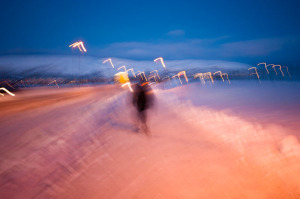
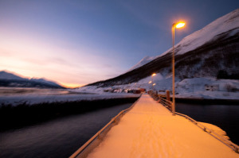
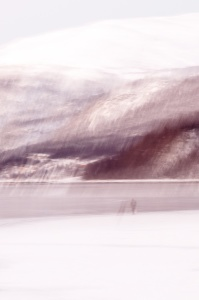
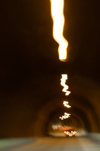
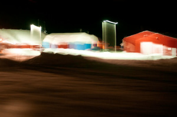
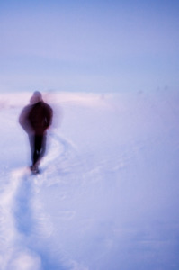
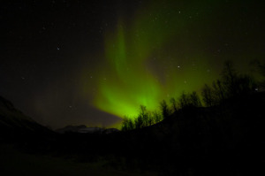
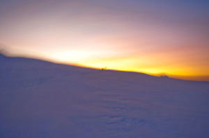

(artículo dedicado a Guillem que tuvo la genial idea de hacer este viaje y de organizarlo)

En este artículo os voy a hablar de cómo organizamos mi hermano y yo un viaje relámpago para ver [auroras boreales](http://es.wikipedia.org/wiki/Aurora_polar) en Noruega. Para ello escogimos la última semana de Diciembre y este lugar por tres motivos:

-   es de noche prácticamente 20 horas
-   el clima es seco y frío
-   es un lugar muy accesible con avión

Los dos primeros motivos son imprescindibles para tener éxito en la captura de la aurora, el tercer motivo imprescindible para la economía.

Qué son las auroras

Las auroras boreales son unas emisiones de luz en el cielo que se producen en los círculos polares ártico y antártico. Se deben a que estos círculos tienen unas propiedades magnéticas especiales que atraen las partículas que se desprenden de las tormentas solares. Estas partículas al entrar en contacto con la atmósfera producen una emisión lumínica que se puede ver desde la tierra. Las auroras en el círculo polar ártico se llaman auroras boreales y en el círculo polar antártico se llaman australes.

Antes de continuar si quieres ver alguna, [pincha aquí](http://www.google.es/images?q=auroras+boreales&hl=es&client=firefox-a&hs=MQz&rls=org.mozilla:es-ES:official&prmd=ivnsu&source=lnms&tbs=isch:1&ei=RRg8Tb7CHdGU4QaW_6ndCg&sa=X&oi=mode_link&ct=mode&cd=2&ved=0CBcQ_AUoAQ&biw=1569&bih=1177) o en esta maravillosa [galería de Ole C. Salomonsen](http://www.flickr.com/photos/salomonsen/)  
La localización

Como os comento el viaje consistió en ir al norte de Noruega, a la [ciudad de Tromsø.](http://es.wikipedia.org/wiki/Troms%C3%B8) Esta está situada en el círculo polar ártico, es una ciudad grande de 30,000 habitantes con todos los servicios y se ubica en una isla entre fiordos.

Cabe recordar que Noruega no pertenece a la comunidad europea pero si eres europeo puedes entrar sin visado con tu DNI o pasaporte. Tiene moneda propia, la [corona noruega](http://es.wikipedia.org/wiki/Corona_noruega) (en el año 2010 está a 1€=8coronas) y el voltaje es de 220V con conectores europeos. Vaya, como si estuvieras en Europa, pero no.

Actualmente hay vuelos prácticamente diarios desde Oslo al aeropuerto de Tromsø que está en la misma ciudad. En nuestro caso viajamos con [Norwegian Airlines](http://www.norwegian.com/es/) desde Barcelona con escala en Oslo por 460€ ida y vuelta con todo incluído.  
Alojamiento

En la ciudad de Tromsø hay mucho alojamiento desde hoteles hasta apartamentos o Bed and Breakfast. Tromsø se está convirtiendo en una ciudad turística y de ahí que la oferta se cada vez más amplia. En la web [www.destinasjontromso.no](http://www.destinasjontromso.no/english/index.html) podéis encontrar mucha información al respecto.

A todo ello, en un radio de 50 km. podemos encontrar muchos apartamentos de alquiler y resorts para hacer una estancia de unos cuantos días y si tenemos vehículo podemos acceder a ellos sin problemas.

En nuestro caso estuvimos en la misma ciudad, en un Bed & Breakfast llamado Anemone Bed & Breakfast ([anemone.skaland.com](http://anemone.skaland.com/)). Es acogedor, las habitaciones tienen dos zonas agradables comunitarias con cocina para los inquilinos y un pequeño parking. Además con previo aviso y pagando un poquito te vienen a buscar al aeropuerto, que por otra parte solo está a 2 km. El precio de la habitación por persona y noche 250 coronas aproximadamente.

La opción de B&B es recomendable porque compartes espacios comunes como la cocina o el comedor con otros inquilinos y entablas amistad. Al final, acabamos haciendo excursiones con toda la gente del B&B.

Cuándo

La mejor época para ver las auroras es el norte de Noruega es en Diciembre y Enero a pesar que se producen durante todo el año en función de la actividad solar de cada día. En Diciembre y Enero las posibilidades de verlas son grandes porque el clima es seco y hay oscuridad durante 20 horas.

Para conocer la actividad solar el siguiente link os será muy útil e interesante: [www.gedds.alaska.edu/auroraforecast](http://www.gedds.alaska.edu/auroraforecast/) Es de un observatorio de Alaska que indica el nivel de actividad solar del día y la previsión del siguiente día en una escala del 0 al 9. En nuestro caso, estuvimos 3 noches con una actividad entre 0 y 2 y logramos ver auroras satisfactoriamente. Otro link muy recomendable es el de centro de predicción del tiempo espacial: [www.swpc.noaa.gov/pmap](http://www.swpc.noaa.gov/pmap) con información muy detallada

  
Dónde

Desde la misma ciudad de Tromsø, apartándose un poco de las calles con más luz se pueden observar las auroras si la actividad solar de ese día es elevada. Pero sin duda los mejores sitios para verlas es adentrándose en el interior del país en los valles y las montañas que ofrecen lugares remotos, únicos y solitarios aunque a veces la costa puede ofrecer espectáculos maravillosos.

La idea es antes de salir a buscar un lugar para ver la aurora, consultar el parte metereológico para buscar aquella zona donde no habrán nubes. Podéis consultar el parte en la web [Weather Forecast for Tromso](http://www.yr.no/place/Norway/Troms/Troms%C3%B8/Troms%C3%B8/) Normalmente la formación de las nubes viene dado por la dirección del viento. Por tanto si el viento sopla del noroeste, irse lo más al sur de Tromsø será muy recomendable dado que las montañas que dejemos atrás en nuestro camino harán de escudo y encontraremos climas más secos. Si por contra los vientos vienen del sureste, es decir del continente, no hará falta moverse mucho porque las nubes no llegarán a las proximidades de la ciudad de Tromsø.

A continuación os dejo un mapa con localizaciones donde vimos auroras boreales y algunos comentarios ([podéis verlo en Google Earth y ampliar la información](http://maps.google.es/maps/ms?ie=UTF8&hl=es&msa=0&msid=207884327808813103475.00049728bec7f9ef82834&ll=69.58248,19.061279&spn=1.882369,6.108398&z=8)):

Ver [En busca de la Aurora](http://maps.google.es/maps/ms?ie=UTF8&hl=es&msa=0&msid=207884327808813103475.00049728bec7f9ef82834&ll=69.42263,19.761486&spn=0.310836,0.386924&source=embed) en un mapa más grande

> Punto A: Un pequeño sendero entre montañas con un río que a pesar que para estas fechas está bajo la nieve y el hielo puedes oírlo bajar. Es un lugar muy tranquilo donde apenas pasa nadie y con un cielo despejado tienes un escenario precioso. Quizá un poco cerrado pero vimos unas auroras que quedaban encima de las siluetas de las montañas. Muy mágico.
> 
> Punto B: La terminación de una carretera de costa en una pequeña central hidráulica y un embarcadero. Una pequeña luz de la central nos cegaba un poco pero a pesar de ello y de las nubes que se formaron rápidamente tuvimos una aurora encima de nuestras cabezas y la pudimos ver bailar más allá de la nube.  
> Este lugar debe ser muy bello en el mediodía invierno.
> 
> Punto C: camino a Komagvik es un pequeño trozo de carretera que va entre un valle. Vimos dos auroras que salían tras la montaña del sur. Con cuidado pudimos dejar el coche en un lateral de la carretera y como no hay tránsito pudimos verlas tranquilamente.
> 
> Punto D: estrictamente no vimos ninguna. Pero en ese lugar pasado 30 minutos que llegáramos vino un mini autobús con 30 turistas de las auroras. Nos dimos cuenta que estábamos en una de las zonas donde las agencias de turismo llevan a sus cliente a ver auroras. Por tanto, seguro que es un buen lugar para verlas, pero no disfrutarlas porque pierde su encanto estar con decenas de turistas, como tu mismo.
> 
> Zonas Azules: lugares de gran belleza.

En general, casi cualquier lugar del interior un poco alejado de los pueblos será un excelente lugar para ver auroras. Pero para llegar a ellos necesitarás de coche e ir bien equipado.

Conducir en Noruega

Conducir en Noruega en invierno es sinónimo a hacer conducción nocturna y sobre carreteras y caminos con nieve y hielo. Tan solo en el caso que comience a haber precipitaciones quizá no podamos agarrar el coche pero como os he comentado en el norte de Noruega en Diciembre y Enero suele tener un clima muy estable. Por tanto no nos tiene que preocupar más que sí tener un especial cuidado a conducir con suavidad, sin prisa y con mucha atención. Las carreteras principales cada día se les pasa el quitanieves y todos los coches están equipados con neumáticos de nieve que permiten circular por ellas sin más problemas. El 80% de los coches no son tracción a cuatro ruedas por tanto podéis ver que tampoco se necesita vehículos especiales. Ahora bien se debe: a) Conducir con suavidad, b) usar marchas largas,c) no bloquear los frenos y d) mantener las distancias entre los coches de una forma un poco más generosa.

Para ir a los lugares señalados en la sección Dónde de este artículo, sin duda te debes sentir cómodo conduciendo porque son muchos kilómetros que haces de noche. En mi caso me gusta y junto con mi hermano podíamos hacer kilómetros y kilómetros sin problemas. Eso sí, si os dirigís a lugares remotos llevar unas mantas porque en caso de avería del coche y que tengas que esperar un tiempo a temperaturas bajo cero sin calefacción hasta que venga la asistencia puede ser peligroso.

En cuanto al alquiler, en el aeropuerto hay bastantes compañías ([Avis](http://www.avis.com/car-rental/avisHome/home.ac), [Europcar](http://www.europcar.es/), [Sixt](http://www.sixt.es/), [Hertz](http://www.hertz.com/),…) y en el centro de Tromsø hay además otra tienda de Avis. El horario de estas compañías es de 10:00 a 17:00 como máximo y todas tienen un buzón donde depositar las llaves para la devolución del coche a cualquier hora. Nosotros alquilamos un 4×4 en Sixt que nos permitió movernos con seguridad y tranquilidad por todas partes. El coste 1000 coronas el día.

Por último comentar que la gasolina no es barata pese estar en un país que vive del petroleo, 12,6 coronas por litro, los ferrys son especialmente caros (alrededor de 1000 coronas para un trayecto de 20 minutos) y que las carreteras principales están llenas de radares.

Equipamiento

Sin duda Noruega es fría en invierno. Pero la ciudad de Tromsø, a pesar que está en el norte tiene en Diciembre y Enero un clima seco con una media de entre -8ºC y 0ºC. De esta forma, Tromsø no es Moscú ni tan solo Oslo y con un buen abrigo, unos guantes cortavientos y sobretodo un buen calzado para caminar por la nieve como son unas botas de montaña impermeables puedes moverte por la civilización.

Pero si quieres ir a ver las auroras a lugares salvajes deberás irte al interior y cuando llegas a un valle hermoso o has subido un poco por un camino de montaña y estás preparado para aparcar el coche y salir a esperar que salga la aurora es cuando ves que el termómetro exterior del coche te indica -13ºC o -16ºC o -20ºC, y esto ya es más serio. En los siguientes parágrafos os hago un breve resumen del equipo de ropa que me llevé y que siempre en cualquier tienda especializada podrán asesorarte mejor. Básicamente necesitas ropa para estar durante una hora o dos sin hacer especial actividad física en un clima seco que puede llegar tranquilamente a los -20ºC.

> Primero unas botas impermeables y térmicas hay nieve por todas parte y las temperaturas son bajas. Como en principio no es necesario caminar ni hacer excursiones, unas botas de descanso bien calientes pueden ser una solución muy válida. Yo llevaba unas buenas botas de montaña de trekking Gore-Tex no térmicas pero con doble calcetín y pasé en algunos momento frío de verdad en los pies. Volver al coche y quitarte las botas bajo la calefacción era un placer aunque otra vez lo intentaré evitar con mejor calzado.
> 
> Segundo, unas mallas térmicas para mantener las piernas y la cadera bien calientes. Que sean mallas muy calientes. En mi caso usé mallas pensadas para dar calor en situaciones de poca actividad física y sobre ellas llevaba unos pantalones técnicos de trekking que son finos y no tuve ningún problema.
> 
> Para las manos guantes térmicos y cortavientos. No es necesario que sean impermeables, si nieva no estaremos mirando auroras y quizá nos ahorremos así llevar guantes aparatosos como los de esquiar. Yo llevaba unos guantes cortavientos con piel que me permitían mucha movilidad en los dedos a la vez que daban calor. Fueron muy bien para manejar la cámara de fotos pero a pesar que me protegían del frío no dudaba en poner las manos en los bolsillos de la chaqueta cuando podía para estar más cómodo.
> 
> Para el cuerpo imprescindible primero una camiseta térmica. Después las posibilidades son muchas pero se necesita ropa que proteja de frío intenso sin hacer actividad física y que corte el viento. En mi caso opté por una o dos capas de vestir como una camisa y una chaquetilla de lana. Luego una buena chaqueta de plumón, con un buen gramaje y que tiene un cierre que protege el cuello y la barbilla así como con un capucha integrada. Y después una última pieza, una chaqueta cortavientos e impermeable de ski que tengo desde hace años. Con este equipo en mi cuerpo en algún momento pasaba frío los primeros minutos pero una vez que la chaqueta de plumón se calentaba estaba muy bien.
> 
> Protector de labios es imprescindible para que no se te corten y protector de piel, en mi caso no lo necesité pero no será malo usarlo.
> 
> Para finalizar complementos como una linterna, quizá dos, una para caminar un poco y otra de luz roja por si debes mirar algo rápido para que el ojo no cierre las pupilas una vez que ya las tienes bien abiertas al haber estado contemplando la noche durante minutos y un buen termo con té caliente dentro son de agradecer.

En resumen, para disfrutar de las auroras en Noruega necesitas un tiempo sin precipitaciones con un cielo despejado en un lugar interesante que puedes llegar en coche sin tener que alejarte de este ni hacer trekking. Por tanto deberás llevar ropa que te conserva el calor y te aísle de la nieve del terreno y un poco del viento que puede llegar a soplar.

Hacer fotografías a las auroras

  
Las auroras boreales no son difíciles de fotografiar una vez que las encuentras y son muy gratificantes porque son fotografías que debes realizar con larga exposición y por tanto el resultado es impredecible. Primero revisemos el material a llevar.

> Cámara fotográfica semi-profesional: Esta cámara debe permitirte configurar manualmente la exposición y el diafragma así como hacer exposiciones de entre 30 segundos y 90 segundos como mínimo o en modo bulb. Así mismo debe ser una cámara que pueda trabajar a temperaturas muy bajas, que pueda usarse con trípode y que tenga retardo en el disparador o posibilidad de disparo por cable. Cualquier cámara réflex del mercado cumple de sobras con estas especificaciones.
> 
> Trípode: imprescindible un buen trípode. Podemos usar uno que sea ligero y cómodo para el viaje en avión a costa de sacrificar un poco de robustez. La verdad es que en principio no vamos a hacer fotos en condiciones donde el viento pueda ser un auténtico problema.
> 
> Baterias: muy importante llevar una batería adicional como mínimo, mejor dos, en el caso de las cámaras digitales. Las baterías con el frío se consumen mucho más rápido y a todo esto vamos a realizar fotos de larga exposición que gastan mucha batería. En mi caso llevaba un chaleco de fotografía debajo de la chaqueta de plumón. Antes de salir de la habitación me colocaba las baterías en los bolsillos del chaleco y de esta forma cuando iba a usar una esta estaba bien caliente y su rendimiento era el mejor posible.
> 
> Disparador remoto: importante para hacer fotos con larga exposición. Permite bloquear el obturador para hacer fotos en modo bulb de más de 30 segundos e impide que se mueva la cámara en el momento de apretar el disparador
> 
> Lentes: lentes muy luminosas (f menor a 3,5) No tenemos que jugar con el campo de profundidad, enfocaremos normalmente a infinito por tanto la luminosidad de la lente nos permitirá obtener fotos espectaculares sin tener que alargar la exposición más allás de un minuto evitando el movimiento de las estrellas y el ruido. En cuando a la distancia focal, para gusto colores, pero sin duda un gran angular nos permitirá captar la grandeza de la aurora sobre un paisaje. En micaso usé un 10mm-20mm y un 30mm y me sentí muy cómodo con los encuadres que me proporcionaban.
> 
> Filtros: para las auroras no hace falta ningún filtro. Puedes eso sí probar filtros de colores si eres creativo. También puedes tener algun filtro degraddo neutro porque de día puedes hacer fotos de paisajes espectaculares con este filtro.  
> Flash: solo si tienes pensado hacer composiciones complejas con las auroras y sujetos cerca de ti.  
> Tarjeta de memoria y cargador de electricidad.

Una vez que tenemos el equipo os comento una forma de hacer fotos a las auroras sobretodo dirigido a los usuarios de cámaras digitales con un poco de experiencia. Pero lo más importante es que cuando lleguéis a un lugar donde creéis que es un buen sitio a esperar montar la cámara en el trípode y configurarla primero. No esperéis a que salga la aurora para prepararlo todo.

Os paso a comentar la configuración de la cámara. Recomiendo usar el modo manual de la cámara con unos valores estándar que os daré ahora y posteriormente hacer pequeñas modificaciones sobre la marcha. De esta forma vamos a controlar el proceso y podremos afinar el disparo.

> Como las fotos son de noche vamos a necesitar de una larga exposición. Es decir, cámara en trípode.

Las cámaras digitales son muy propensas a generar ruido en la foto cuando usamos ISO un poco altas y como tenemos trípode y podremos hacer exposiciones tan largas como sean necesarias hemos de asegurarnos de configurar una ISO baja, 100, 200 o 400 como excepción.  
No va mal aseguraos que tenéis configurado la calidad RAW+Jpeg que puedes configurar en casi cualquier cámara. RAW porque te generará un fichero que después tú o un especialista podrá sacar todos los detalles y colores de la aurora. Jpeg para que a la vez te genere un fichero listo para enviar a tus amigos tan pronto cuando llegues al hotel :).  
En cuanto al balance de blancos, no es muy importante porque al final lo podremos ajustar luego en el ordenador dándole un toque creativo. Por tanto, escoger una temperatura cálida como 5000K o el modo sol para que no os llevéis sorpresas al visualizarlas en la pantalla de la cámara.  
El diafragma abrirlo mucho. Si puede tu objetivo llegar f/2,8 adelante, sino a la f más pequeña posible. El tiempo de exposición irá en función de la abertura y la ISO pero con un diafragma f2.8 y ISO 200 una exposición de 60 segundos será muy correcta. Ahora bien, esto cambia en función de la aurora y las condiciones de luz de la noche.  
Finalmente el enfoque, que os recomiendo ponerlo en modo manual y dejarlo en el valor infinito. Esto nos evitará que la cámara se vuelva loca a la hora de enfocar en las nulas condiciones de luz que tendremos.

De esta forma, una vez configurada la cámara miramos un poco el paisaje y situamos la cámara con el trípode en un lugar estratégico y nos relajamos hasta que comience a aparecer la aurora. De verdad, relajaos y disfrutar de la noche. Si habéis preparado la cámara justo después de llegar al lugar podréis posteriormente disfrutar del momento y observar la noche a la espera que aparezca la aurora, normalmente por el este… Cuando lo haga, cogéis el trípode con la cámara, reencuadráis y partir de allí ir haciendo fotos. Con la cámara digital podremos ver los resultados de inmediato y básicamente solo deberéis ir ajustando el tiempo de exposición a un tiempo óptimo. Recordar de usar el disparador remoto para evitar que la foto quede trepidada, si no lo tenéis podéis usar el temporizador del disparo.

Conclusión

Este es uno de los viajes más singulares que he realizado y es muy recomendable si para las fiestas navideñas deseas hacer una escapada diferente desde Europa con moderadas horas de viaje, 5 en avión. El precio a pagar no es barato, la vida en Noruega es muy cara y el alojamiento, la comida y desplazamiento no se escapa. Estaríamos hablando de 5 días 800€ sin ningún lujo y sin contar el equipamiento de ropa que debas comprarte. También es cierto que puedes ahorrarte de apuntarte con empresas que organizan excursiones para ver auroras si eres un poco explorador, porque entre otras cosas te ahorarrás como mínimo mínimo 300€

Pero este es el precio que hay que pagar en este viaje para aterrizar en otro mundo donde la luz que tan solo asoma durante una franja de 4 horas en el mediodía tiene unas tonalidades naranjas y rosas, donde la nieve lo cubre todo vistiendo las montañas con un elegante vestido blanco, donde el frío congela la vida de lagos y fiordos y en donde puedes tener una cita realmente emocionante en la noche con la “Lady” ( la aurora boreal ), eso sí, si ella quiere.

  
Links  

-   Turismo de auroras boreales en Noruega: [http://www.visitnorway.com/en/Articles/Theme/What-to-do/Attractions/Nature/Let-there-be-northern-lights/](http://www.visitnorway.com/en/Articles/Theme/What-to-do/Attractions/Nature/Let-there-be-northern-lights/)

-   Cómo hacer fotos a las auroras con cámaras analógicas: [http://www.ptialaska.net/~hutch/aurora.html](http://www.ptialaska.net/~hutch/aurora.html)
-   Predicción del tiempo en Tromsø: [http://www.yr.no/place/Norway/Troms/Troms%C3%B8/Troms%C3%B8/](http://www.yr.no/place/Norway/Troms/Troms%C3%B8/Troms%C3%B8/)
-   Webcam y datos estadísticos metereolóficos de la ciudad de Tromsø: [http://weather.cs.uit.no/](http://weather.cs.uit.no/)
-   Experto en la caza de auroras australes: [http://geoffcloake.co.nz/Aurora/Aurora.htm](http://geoffcloake.co.nz/Aurora/Aurora.htm)
-   B&B Amesone: [http://anemone.skaland.com/](http://anemone.skaland.com/)
-   Predicción y detalles de los vientos solares: [http://www.gedds.alaska.edu/auroraforecast/](http://www.gedds.alaska.edu/auroraforecast/)
-   Predicción espacial: [http://www.swpc.noaa.gov/pmap](http://www.swpc.noaa.gov/pmap)
-   Explicación en detalle del equipo que debes llevar para hacer fotos a auroras: [http://aurorahunters.com/blog/?page\_id=543](http://aurorahunters.com/blog/?page_id=543)
-   Fotografías de auroras de Ole C. Salomonses: [http://www.flickr.com/photos/salomonsen/sets/72157623158963323/](http://www.flickr.com/photos/salomonsen/sets/72157623158963323/)  
    
-   ***100 Best things to do in Norway by Jen Reviews***: [https://www.jenreviews.com/best-things-to-do-in-norway/](https://www.jenreviews.com/best-things-to-do-in-norway/)

El texto y las fotografías de este artículo son de Lluís Ribes i Portillo y están bajo licencia Creative Commons [Attribution-NonCommercial-NoDerivs 2.0 Generic](http://creativecommons.org/licenses/by-nc-nd/2.0/)