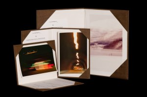

Una gran novedad en mis fotografías. Desde ya las fotografías que entrego podrán venir con una carpeta hecha a mano y a medida de la fotografía. Esta carpeta realizada con tela en su exterior y forrada con papel ph neutro en su interior dispondrá de pestañas para adjuntar la foto en un lado y al otro lado su certificado de autencidad.

Como ejemplo tres de las fotografías, que son primeras copias de mi serie de “[A la recera de l’aurora”](http://fotos.lluisribes.net/2-2011/index.html), que han sido entregadas hoy a sus nuevos dueños con la carpeta hecha a medida y el certificado:

