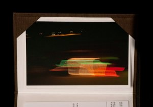

“El cotxe de Santa Claus” es de esas fotos que las tomas y no le das importancia al momento. Parece que tomes un foto furtuita pero…

La búsqueda de auroras en Noruega requiere a pesar que estés en un ciudad en el círculo polar ártico moverte un poco con coche para encontrar un escenario especial para verlas. Realizamos muchos kilómetros de noche cada día para dirigirnos al interior del país y ya el primer me fijé en un coche decorado con luces de navidad aparcado cerca de Seljelvnes mientras conduciamos por la carretera 91 . Sí, decorado con luces de navidad como si de un abeto se tratara.

Pensé qué cosa más extraña que he visto y que quizá jamás volvería a ver y no le di más importancia. Pero cosas de la vida, el último día viajaba de copiloto con la cámara en mano tomando instantaneas del norte de Noruega tras una ventanilla de coche. Y de repente apareció el mismo coche aparcado a lo lejos. Cada vez nos acercábamos más y más. Me dio tiempo de levantar la cámara a la altura de mis ojos, mirar y en el corto tiempo que hay en un marco como es la ventana de un coche cuando este recorre 60 km/h hice la foto.  
… te das cuenta que tomas un instante de tu vida que te llamó la atención. Y cómo no te llamaría la atención si de bien seguro que aquello era el coche de Santa Claus.

Descripción  

-   [“El cotxe de Santa Claus”](http://www.flickr.com/photos/lluisr/5421790215/) (#110005/#000001)

Todo el proceso desde la toma de la fotografía hasta el montaje pasando por la edición e impresión han sido realizados por mi personalmente mimando la calidad de todo el proceso.

La primera copia de la fotografia viene con un estuche hecho a medida en forrado de tela en su exterior y con un papel ph neutro en su interior. El estuche lo conceptualicé juntamente con el taller de encuadernación [Charnela Encuadernación](http://www.charnela-enquadernacio.com/). Esta copia está impresa a un tamaño de 14cmx21cm sobre un papel tipo lienzo mate. Aquí un detalle de ella:  
