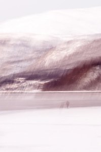
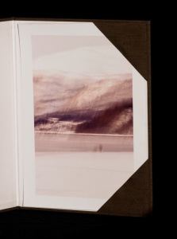

Pescador noruec – [Lluís Ribes i Portillo (cc)](http://creativecommons.org/licenses/by-nc-nd/2.0/)

La fotografia del “Pescador Noruec” forma parte de la colección de “[A la recerca de l’ aurora](http://fotos.lluisribes.net/2-2011)“. Es una fotografía tomada en el fiordo Balsfjorden de Noruega en una mañana de invierno. Comenzando una excursión a media ruta nos atrajo este paisaje entre montañas donde el hielo se comía el agua del fiordo creando una playa blanca. Nos paramos y nos disposimos a dar una vuelta. Podéis ver como era el lugar en la siguiente panorámica:

 por lluisribes, en Flickr")

Balsfjorden – [Lluís Ribes i Portillo (cc)](http://creativecommons.org/licenses/by-nc-nd/2.0/)

El fiordo que se abría más allá de las montañas del horizonte se cubría de una niebla en las heladas aguas. Pero la sorpresa fue ver a un pescador, en la orilla del hielo tranquilamente pescando en la solitud.

Realicé una serie de fotografias con el tele de 85mm usando la técnica de trepidar la cámara en la toma y con una velocidad lenta. La suave luz de la mañana del invierno noruega me lo permitía. Y esta fotografía se “pintó” en el sensor de la cámara como un recuerdo melancólico de un curioso lugar.  
Descripción

-   [“Pescador noruec”](http://www.flickr.com/photos/lluisr/5421790215/) (#110004/#000001)

Todo el proceso desde la toma de la fotografía hasta el montaje pasando por la edición e impresión han sido realizados por mi personalmente mimando la calidad de todo el proceso.  
La primera copia de la fotografia viene con un estuche hecho a medida en forrado de tela en su exterior y con un papel ph neutro en su interior. El estuche lo conceptualicé juntamente con el taller de encuadernación [Charnela Encuadernación](http://www.charnela-enquadernacio.com/). Esta copia está impresa a un tamaño de 19cmx29cm sobre un papel tipo lienzo mate. Aquí un detalle de ella:  
