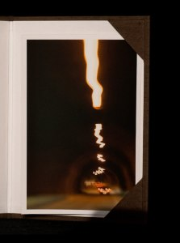

  
[Submarí – Lluís Ribes i Portillo (cc)](http://creativecommons.org/licenses/by-nc-nd/2.0/)

Esta fotografía fue tomada en el túnel submarino que une la isla de Kvaløy con Ringvassøy desde el pueblo de Myra. Tras esperar más de treinta minutos a las diez de la noche a que abriesen el tráfico a causa de unas obras nos disposimos a seguir una furgoneta de seguridad que nos guiaba por dentro del estómago de la roca sorteando vehículos de obras y otros elementos esparcidos por el asfalto.

“Los túneles submarinos bajan para luego subir”

Descripción

-   [“Submarí”](http://www.flickr.com/photos/lluisr/5421791073/) (#110006/#000001)

Todo el proceso desde la toma de la fotografía hasta el montaje pasando por la edición e impresión han sido realizados por mi personalmente mimando la calidad de todo el proceso.  
La primera copia de la fotografia viene con un estuche hecho a medida en forrado de tela en su exterior y con un papel ph neutro en su interior. El estuche lo conceptualicé juntamente con el taller de encuadernación [Charnela Encuadernación](http://www.charnela-enquadernacio.com/). Esta copia está impresa a un tamaño de 21cmx14cm sobre un papel tipo lienzo mate. Aquí un detalle de ella:  
