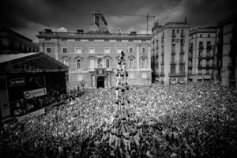
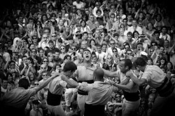
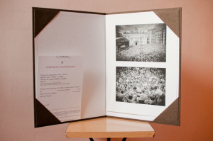

  

Este díptico está creado con dos fotografías tomadas desde el balcón del Ayuntamiento en la jornada castellera que se realizó para las fiestas de la Mercè del 2010. Ambas fotos pertenecen al mismo *castell.* La primera es el momento de la coronación de un *“4 de 9 amb folre”*. La segunda fotografía es el momento de júbilo del *folre* después que el *castell* descargara con éxito. Ese año 2010 fue el mismo año donde *“Els Castells”* fueron declarados como [Patrimonio Cultural Inmaterial](http://www.unesco.org/culture/ich/index.php?lg=ES) por la [Unesco](http://www.unesco.org/).

La jornada castellera de las fiestas de Barcelona se caracteriza por su escenario. Una plaza de Sant Jaume que se llena de aficionados, curiosos, turistas, algún despistado y más de un sorprendido que aun no cabiendo todos en la plaza continúan llenando las calles circundantes. Entre estos espectadores dos importantes instituciones son representados por sus sedes en la plaza: el Ayuntamiento de Barcelona y la Generalitat de Catalunya.

Creer, ver, sentir. Las torres se levantan a la vez que los brazos de los espectadores lo hacen para protegerse del sol o para inmortalizar en el momento en sus cámaras. Lo que al principio es un constante murmureo mientras el tronco se forma en un minuto comienza a ceder en el momento en que se levantan los últimos pisos, el *pom de dalt,* y comienza [a sonar los tambores con la gralla](http://www.goear.com/listen/230953a/toc-de-castells-castellers). Aparece la incertidumbre, los niños del pomo están a más de 6, 7, 8 o más metros por encima del público intentando colocarse en posición. La preocupación suena a través de las cuerdas vocales de la gente …

**….. …. … .. .**

… cuando de repente la *enxaneta* levanta el brazo en la cima coronando el *castell* y toda la plaza salta de alegría, los brazos se elevan más que nunca … un **éxito**. Pero ahora toca descargar. La torre tambalea, unos cuantos pisos por arriba, la *enxaneta* comienza a bajar rápidamente y así los pisos inferiores. Son como gotas que descienden por una roca frágil de hielo que se está agrietando. Los espectadores gritan, la tensión es alta: que se derrumba la torre al vacío es una gran probabilidad pero no una opción. Continua descargándose. ¡Los últimos pisos ya están descargados! Solo queda un par de pisos que ya no tambalean de sufrimiento sino de alegría. ¡La plaza comienza a bullir! un piso menos, todos comienzan a gritar, está cerca, descargan el primer piso y la euforia se desata. Los *castellers* aun encima de la muchedumbre comienzan a saltar, a gritar al cielo con todo el cuerpo en tensión. Los aplausos invaden el escenario y todos comienzan a votar. ¡Ue ue ue! ¡Ha sido otro **éxito!!**

**Descripción**

-   “[Èxit](http://www.flickr.com/photos/lluisr/5026689945/)” (#110007/#000001)
-   “[Èxit!!](http://www.flickr.com/photos/lluisr/5027300802/)” (#110008/#000001)

Todo el proceso desde la toma de las fotografías hasta el montaje pasando por la edición e impresión han sido realizados por mi personalmente mimando la calidad de todo el proceso.

La primera copia del díptico viene con un estuche hecho a medida forrado en tela en su exterior y con un papel ph neutro en su interior. Esta copia está impresa en un papel de tipo lienzo mate. Ambas fotografías tienen un tamaño de 20,9cm x 14cm.

A continuación podéis ver un detalle de la obra:

