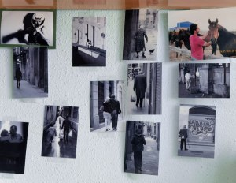

[Paret – Lluís Ribes i Portillo (cc)](http://creativecommons.org/licenses/by-nc-nd/2.0/)

[The Man Who Sold the World – David Bowie (Versión de Nirvana)](http://www.goear.com/listen/1904b61/the-man-who-sold-the-world-nirvana)

> “We passed upon the stair,we spoke of was and when  
> Although I wasn’t there,he said I was his friend  
> Which came as some surprise I spoke into his eyes  
> I thought you died alone,a long long time ago  
> Oh no,not me  
> I never lost control  
> You’re face to face  
> With the man who sold the world  
> I laughed and shook his hand,and made my way back home  
> I searched for form and land,for years and years I roamed  
> I gazed a gazley stare at all the millions here  
> We must have died along,a long long time ago  
> Who knows? not me  
> We never lost control  
> You’re face to face  
> With the man who sold the world”