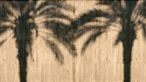

Hace unos tres años que de tanto en tanto paso por la Ronda Litoral en Barcelona a la mañana y me fascina las sombras de las palmeras sobre el hormigón de los muros de la vía. Hoy, aprovechando que ha sido fiesta y un puente largo muy tranquilo he salido a fotografiar esta bello momento.

He realizado varias fotos, la verdad es que el acceso es fácil aunque la composición complicada si la foto se realiza desde el lateral. Pero haciendo fotos y observando he descubierto en un momento concreto (lo fascinante es que las sombras están en constante transformación porque el sol no para de subir) a una pareja de palmeras rozándose:

L’Amor de les Palmeres de la Ronda Litoral – [Lluís Ribes i Portillo (cc)](http://creativecommons.org/licenses/by-nc-nd/2.0/)

Así habrán estado unos 30 minutos hasta que el sol, dueño y señor que las unió en el frío hormigón a primera hora de la mañana las habrá separado hasta el día siguiente… y es que este es el amor de las palmeras de la Ronda Litoral: rutinario y programado.