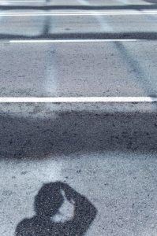

Dos semanas atrás me invitaron a una salida fotográfica del [Colectivo F16](http://www.f16fotografia.com/) a [Belchite](http://es.wikipedia.org/wiki/Belchite), un pueblo en Aragón que fue destruido totalmente en la [guerra civil española](http://es.wikipedia.org/wiki/Guerra_civil_espa%C3%B1ola) y a día de hoy se puede visitar sus ruinas. La salida consistía en hacer fotos nocturnas del pueblo, previo a dos clases: “Composición fotográfica” y “Fotografía nocturna”.

La clase de “Fotografía nocturna” la realizó Jordi y aprendí conceptos claves de este tipo de fotografía :). Y la clase de “Composición fotográfica” la impartí yo lo que me obligó preparármela un poco durante los días previos.En este preparación pensé que sería muy interesante crear paralelamente una página web con la teoría del curso y algunos ejemplos. Y eso es lo que hice y la acabé hoy. La web la podéis ver aquí:

[http://compofoto.lluisribes.net](http://compofoto.lluisribes.net/)

Es un tutorial donde se explican muchos de los recursos de composición (no todos) que se usan en la fotografía y a través de algunas de mis fotografías podéis ver ejemplos de cada uno de estos recursos o reglas.

Hay un montón de información alrededor de la composición en Internet pero he querido agrupar un buen puñado de esta información en la misma web insertando mis puntos de vista (al final de este artículo encontrarás los principales links que me han servido de fuente).  
Así mismo hay un hash tag llamado [#compofoto](https://twitter.com/#%21/search/%23compofoto) que relaciona este tutorial con twitter.  
La verdad es que llevo días trabajando en la web pero no ha sido hasta este fin de semana que he estado en Barcelona donde le he dedicado unas cuantas muchas horas para acabarlo y retocar los detalles.  
La web es muy estática, si queréis dejar comentarios lo podéis hacer en este mismo artículo del blog.  
¡Espero que le sea interesante a alguien! 🙂 y ¡a continuar disfrutando de la fotografía!

Fuentes usadas para la web:  
[http://www.botanical-onlice.com/composicionfotografica.htm](http://www.botanical-onlice.com/composicionfotografica.htm)  
[http://www.fotonostra.com/fotografia/componerfotografia.htm](http://www.fotonostra.com/fotografia/componerfotografia.htm)  
[http://www.artecompo.com](http://www.artecompo.com/)  
[http://www.dzoom.org.es/noticia-1479.htmls](http://www.dzoom.org.es/noticia-1479.htmls)  
[http://es.wikipedia.org/wiki/Composici%C3%B3n\_fotogr%C3%A1fica](http://es.wikipedia.org/wiki/Composici%C3%B3n_fotogr%C3%A1fica)