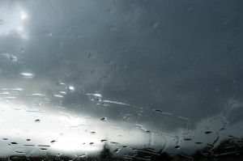

[Ya no me acuerdo](http://www.goear.com/listen/fc445e9/ya-no-me-acuerdo-estopa) – [Estopa](http://es.wikipedia.org/wiki/Estopa_%28banda%29)

Esta mañana  
Ya no me acordaba

> Cómo tocaban mis dedos  
> Esa guitarra que era  
> Para mí tu cuerpo  
> Ya no me acordaba lo que sentía  
> Cuando acariciaba tu pelo  
> Ya no me acuerdo  
> Si tus ojos eran marrones o negros  
> Como la noche o como el día  
> Que dejamos de vernos  
> Sólo recuerdo que llovía y que quedamos  
> En la parada del metro  
> Pero haciendo un gran esfuerzo,  
> Aún veo tu mirada  
> En cada espejo de cada ascensor  
> Donde cada noche  
> Me sube hasta el cielo  
> De moteles invernadero  
> Donde se jura algo tan efímero…
> 
> Ya no me acuerdo  
> Ni de tu risa  
> Ni de tu prisa  
> Por darme un beso  
> Ni qué botón  
> De tu camisa  
> Desabrochaba primero.  
> Ni qué rumba me bailabas  
> Cuando querías robarme el sueño  
> Dicen que el tiempo y el olvido  
> Son como hermanos gemelos  
> Que vas echando de más  
> Lo que un día echaste de menos  
> Yo qué culpa tengo  
> Si ya no me acuerdo  
> Pero haciendo un gran esfuerzo,  
> Aún veo tu mirada  
> En cada espejo de cada ascensor  
> Donde cada noche  
> Me sube hasta el cielo  
> De moteles invernadero  
> Donde se jura algo tan efímero  
> Y tan eterno,  
> Ya no me acuerdo,  
> Ya no me acuerdo