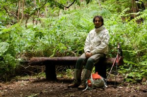

(sense titol) – [Lluís Ribes i Portillo (cc)](http://creativecommons.org/licenses/by-nc-nd/2.0/)

Un autoretrato en el parque Nacional de Garajonay.

Aquí estoy descansando en frente de la cámara y de uno de los pocos ejemplares que quedan de saúco canario, de verdad, si lo vieráis… Mis botas que cumplirán 10 años de viajes manchadas de rojo de una excursión el día anterior por suelos ferrálicos erosionados cerca del mirador de Abrante, mis pantalones que tras 15 días de duro trabajo en la India desaparecieron durante más de un año hasta que un día hace poco se presentaron como por arte de magia ¿querían volver a viajar?. La chaqueta para el viaje a Escocia, blanca para evitar sin éxito los myggies, mis mofletes cada vez más hinchados como lo es mi barriga bajo la chaqueta que ya conocéis y los rizos del pelo indomables que accentúan la caída de este. La bolsa ligera como una pluma llena de hierro , vidrio, plástico y silicio con más de 800 instantáneas fotográficas en su interior que a día de hoy no sé que hacer con ellas y mis nuevas compañeras de excursiones que son mis palos. Un banco. Y el resto, naturaleza.