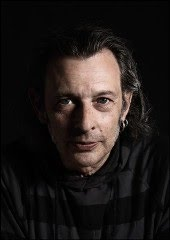

Manel Esclusa – [Olga Balibrea(c)](http://www.olgabalibrea.com/index.html)

Este año en Passanant hubo una conferencia de [Manel Esclusa](http://www.blancaberlingaleria.com/artistas/manel_esclusa/index.html). [Manel Esclusa](http://ca.wikipedia.org/wiki/Manuel_Esclusa) es un fotógrafo catalán que ha traspasado fronteras. Nos presentó su último trabajo “Ombra del paisatge” donde captura sombras generadas por la naturaleza usando una cartulina blanca.

De la conferencia me quedo con los siguientes momentos.

Primero cómo nos contó que su vida siempre ha estado relacionada con la fotografía. Desde los 10 años su padre que fue inventor, pintor y fotógrafo le hacía preparar los reveladores. Aquí descubrió la magia de la fotografía y de hecho de donde provenía esta magia que no es de otro lugar de combinar productos químicos con papeles que habían sido expuestos. Continuando con su infancia explicó las excursiones que realizaba cuando fue un poquito más mayor acompañando a su padre a cuevas donde mientras este se adentraba en ellas, él se quedaba esperando en la entrada durante largas esperas. En estas esperas entraba en contacto con la oscuridad más absoluta que apenas podía iluminar con una débil linterna. En esta época, y exponiendo una posible vía para psicoanalizarse :), dijo descubrir la oscuridad que le acompañaría en gran medida en su obra posterior.

Tras esta pequeña introducción pasó a comentar su trabajo más reciente “Ombra del paisatge” y me pareció interesante cuando afirmó que las sombras son de las pocas representaciones naturales que existen. Puso como otros ejemplos los reflejos, en según que medida las estrellas porque estamos viendo estrellas que quizá ya no existan y las proyecciones del exterior que aparecen en las paredes de las cuevas cuando la luz entre por un pequeño agujero ( ¿El “Mito de la caverna”?)

Todo ello lo enlazó con su proyecto anterior de “Eclipse” que fue la semilla de “Ombra del paisatge“. “Eclipse” fue un proyecto exitoso donde quiso capturar la visualización de un eclipse con una proyección a través del follaje de un árbol consiguiendo así miles de eclipses gracias a que cada agujero entre las hojas se convertía en un objetivo (me pareció fascinante la idea y el resultado). Este proyecto le obligó a usar una cartulina blanca donde las proyecciones aparecían siendo la base esta idea para su siguiente trabajo ya comentado “Ombra del paisatge“.

Para acabar los momentos álgidos incorporar las siguientes frases que expuso durante la sesión:

-   “Los trabajos no acaban nunca, se abandonan” haciendo referencia a los trabajos de fotografía, por ejemplo, que si uno no pone un límite podrían estar ampliándose indefinidamente
-   “Si el azar pasa es porque trabajas” que es otra manera de decir “La suerte hay que buscarla” . Más cierto imposible.

Charla muy interesante.