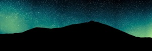

“La nit del Teide” – [Lluís Ribes i Portillo (cc)](http://creativecommons.org/licenses/by-nc-nd/2.0/)

  
  

“Cuando siento una necesidad de religión, salgo de noche para pintar las estrellas”  

[Vincent Van Gogh](http://es.wikipedia.org/wiki/Vincent_van_Gogh)