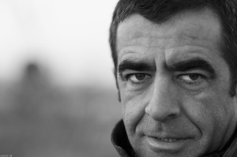

“Naxo” – Lluís Ribes i Portillo (c)

La fotografía Naxo fue tomada en el 2008 una mañana de un sábado frío en la cabecera de la pista 25L del aeropuerto de Barcelona. Las antiguas quedadas con amigos del flickr siempre daban juego a hacerse alguna foto entre nosotros y fruto de la casualidad o no apareció esta instantánea bajo la mirada atenta del objetivo 85 mm que tenia instalado en mi cámara en esos momentos.Hace poco, esta instantanea se materializó en un foto que la incluí dentro de mi colección y fue regalado para una fecha especial.

**  
Descripción**

-   “[Naxo](http://www.flickr.com/photos/lluisr/2187871319/)” (#110009/#000001)

Todo el proceso desde la toma de las fotografías hasta el montaje pasando por la edición e impresión han sido realizados por mi personalmente mimando la calidad de todo el proceso.

La primera copia de la foto (14,9cm x 9,9cm) se imprimió en papel lienzo con un gramaje de 390g/m2 usando tintas de alta calidad. Se entregó con un marco negro de casa Ferrer y con su correspondiente firma y numeración en el dorso.