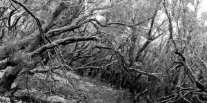

Hola,  
estos días si alguien entrara en mi cabeza encontraría un paisaje parecido al siguiente…

“Branques” – [Lluís Ribes i Portillo (cc)](http://creativecommons.org/licenses/by-nc-nd/2.0/)

  
… ahora tan solo hay que hacer brotar esas ramas.