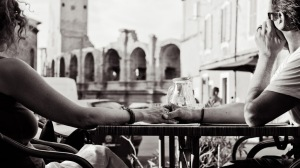

Arlés, 9 Julio 2011. Estaban sentados en la Creperie Chez Mam Goz a la vez que otra pareja, esta de artistas flamencos, [cantaban una canción de los Gypsy Kings](http://youtu.be/zNdZNRktLoI):

Foto: (sin título) – [Lluís Ribes i Portillo (cc)](http://creativecommons.org/licenses/by-nc-nd/2.0/)

Música: [“La montaña” de Gypsy Kings interpretada por La Flor](http://youtu.be/zNdZNRktLoI)