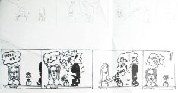

Ordenando documentos y papeles me he topado con quizá la única tira cómica que he intentado hacer. La dato del año 2000 o 2001 y he vuelto a viajar a otras épocas. En fin… Me parece una tira curiosa y con una idea currada. Podéis ver un boceto en la parte superior de la hoja y en la parte inferior el dibujo definitivo del que me sorprende este personaje negro, un ser que te roba energía en tu día a día. Pero el final aquí es feliz:

 Muy Bien | Bien | … | Muy Bien!

a disfrutar,