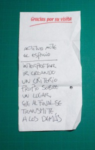

Limpiando la cartera de papeles me encuentro con una servilleta de bar con una interesante reflexión que escribí un día pero que no me acuerdo cuando, ni tampoco quién me la dijo (tengo un vago recuerdo que lo anoté en una conversación sobre actitud al dictado de un amigo en un bar). Dice así:  

  
  

“Actitud ante el espacio: interpetrar ir creando un criterio propio sobre un lugar que al final se transmite a los demás”  

Por lo entera de la servilleta escribiría este texto en Junio, Julio o Agosto de 2011 pero no soy capaz de recordar de quién era ni cuándo la escribí. Dejo una foto por si coincide que sea de uno de los lectores de mi blog y me hacer recordar el momento.

como siempre, gracias por su visita.