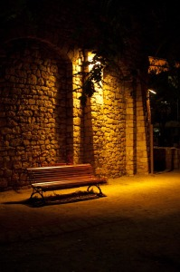
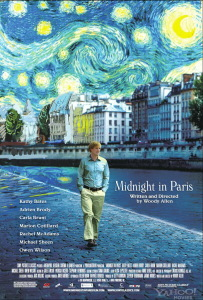

Ayer en ese banco que aparece en la foto de la izquierda acabé de leer “El viejo y el mar” de [Ernest Hemingway.](http://es.wikipedia.org/wiki/Ernest_Hemingway) Un pequeño cuento maravilloso con una narración tan increíble que parece mentira que en un cuento tan sencillo se esconda tanta intensidad. Aun se me clava el sedal del pescador en toda mi espalda…

Su autor, el escritor y periodista ganador de un premio nobel de literatura por su trayectoría, el estadounidense Ernest Hemingway, lo he tenido presente en varios momentos estos últimos meses lo que me llevó a leer este cuento.

Primero en la película “[Midnight in Paris](http://www.imdb.com/title/tt1605783/)” donde aparece el personaje como un incontrolable joven, valiente y aventurero que viaja por toda Europa y que acaba en emociones más fuertes en las escapadas a los safaris africanos que se monta. Este personaje en la película no es principal pero es divertido ver como el personaje principal interpretado por [Owen Wilson](http://www.imdb.com/name/nm0005562/) se queda alucinado al conocerlo.  
Posteriormente, volvió a aparecer en mi vida casualmente al decidir de leer los libros de [Philip Kerr](http://www.pbkerr.com/) sobre Bernie Gunther. En el sexto libro, “[Si los muertos no resucitan](http://es.wikipedia.org/wiki/Si_los_muertos_no_resucitan)” Bernie rehace una vida nueva en la Cuba anterior a la revolución. Pero topa con una antigua amante que vive nada más y nada menos que en la Finca Vigía, la casa que tuvo Ernest Hemingway en Cuba. Aquí no aparece él (Hemingway durante el transcurso de los acontecimientos del libro está de viaje en África) pero las diversas descripciones de las estancias de la Finca Vigía así como algunos comentarios de los personajes de la novela alrededor de Hemingway te hacen captar el interés por él.  
Y fue cuestión de unos días que Vicente me comentó por casualidad que se acababa de leer “El viejo y el mar“. Sus comentarios del libro y el creciente interés por la figura de Ernest Hemingway me animó a leerlo estos días. Y ha sido un acierto. Y yo ahora hago lo mismo, recomendaros que dediquéis dos o tres horas en leerlo. Porque el viejo se lo merece…