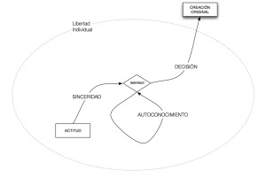

> Partiendo de que somos individuos, y como tales únicos y genuinos, si un individuo dentro de su libertad toma como actitud la vía de la sinceridad fomentará un conocimiento más puro de ese individuo y mediante su decisión realizará una poderosa creación original.
> 
> El potencial que tiene una sociedad para crear creaciones originales estará relacionado con cuánto de grande es el espacio de la libertad individual que permite tomar actitudes sinceras, conocerse y tomar decisiones.
> 
> 
> 
> Este es un resumen de mi conclusión a partir de las diversas discusiones que tuvimos en el [taller de fotografía de Cabo de Gata](http://www.talleresencabodegata.com/) alrededor de las creaciones originales. Aplíquese a otros ámbitos no estrictamente artísticos y que continúe la discusión.