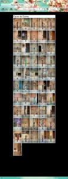

Hay quien se pregunta qué son estas fotografías de pilones de calle que he colgado en la siguiente web:

[http://fotos.lluisribes.net/carrer\_de\_comte/](http://fotos.lluisribes.net/carrer_de_comte/)

Os lo explico. En la [ciudad de Tarragona](http://es.wikipedia.org/wiki/Tarragona) existe una calle en el casco antiguo llamada *Carrer de Comte*, cerca del museo de historia de la ciudad. [Es una pequeña calle, actualmente peatonal](http://rogertee.blogspot.com/2011/07/tarragona-parte-1-carrer-del-comte.html), de unos 90 metros de largo. Años atrás, en el 2005 hubo un movimiento de tierras que obligó a desalojar viviendas durante semanas ([Tarragona Radio.cat](http://www.tarragonaradio.cat/detalleOM.asp?id=19351&t=Els-pilons-del-carrer-Comte-llueixen-nou-aspecte-i-disseny)) y fue a partir de ese año que se instauró la tradición de pintar los pilones cada año con motivos totalmente diversos.Buscando un poco por internet obtengo poca información más que algún post de queja por la irracionalidad de los pilones (hay uno cada 3 metros como máximo) que impiden la movilidad por la calle, también quejas por las incomodidades de las diversas obras que se han realizado y finalmente porque esto de las pintadas se ha convertido en una tradición un poco snob, sin ningún [sentido más que el estropear inmobiliario urbano para hacer algo poco serio](http://savecascantic.blogspot.com/2008/06/carrer-del-pilons-pilon-parade-2008.html).

¿Mi opinión? Cuando llegué a la calle me pareció divertido y me llamó la atención. Me gustó, ok, no pensé en las molestias a los vecinos de tener una calle pintada y una serie de pilones puestos sin sentido. Pero mira por donde llevaba la cámara a mano y me pareció interesante sacarle una foto a cada uno de los 50 pilones. Y así monté la web.

La verdad es que pueden parecer insignificantes estas fotos, o haber montado la web y o hablar del *Carrer de Comte*. Pero no lo es, tan solo quería hacerlo.

 