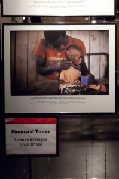
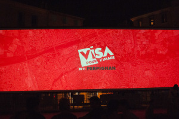

Os dejo un pequeño resumen de mi visita al [Visa Pour L’image de 2011](http://www.visapourlimage.com/). Primero os comentaré qué exposiciones me han parecido más interesantes y luego añadiré unos apuntes de más de la ciudad de dónde dormir y tomar algo mientras estás en el festival.

El festival está aun hasta el próximo fin de semana inclusive el domingo día 11 de septiembre, por tanto si te interesa mínimamente los reportajes fotográficos y no tienes nada que hacer estás a tiempo de ir.

**Exposiciones**

Respecto al año pasado me ha sabido a menos esta edición pero siempre hay algunos trabajos que te gustan en especial y así ha sido. Destacaría 5 trabajos.

*“[El encarcelamiento de jóvenes en África](http://www.fernandomoleres.com/categorias.php?cat=0039)“*, por [Fernando Moleres](http://www.fernandomoleres.com/) y las agencias [Panos](http://www.panos.co.uk/) y [laif](http://www.laif.de/): trabajo sobre los niños encarcelados en prisiones africanas, prisiones que comparten con los convictos adultos. Unas fotografias muy buenas pero además con un trabajo muy centrado y con un apoyo de pies de texto que te explican casos concretos de muchos chavales. Recuerdo varios casos: el de un chico que lo encarcelan por tres años por robar un móvil en la escuela, otro que lo meten en prisión compartiendo celda con una banda de sanguinarios y finalmente al chaval le juzgan como miembro de la banda, un chaval que muere enfermo tras cuatro meses esperando conocer sus cargos y muchos más. De Fernando Moleres ya había visto algún proyecto, como el de los niños en la gimnasía china y la verdad me parece un tipo que realiza buenos trabajos. Pero sin duda, este del encarcelamiento de niños africanos es muy interesante. Hay un extenso artículo, “[El Infierno en la tierra](http://www.elpais.com/articulo/portada/infierno/tierra/elpepusoceps/20110109elpepspor_8/Tes)“, en El País donde hay un video de 6 minutos que hace un buen resumen de todo.

*“[Atrapado entre dos fuegos](http://framework.latimes.com/2011/04/18/caught-in-the-crossfire-pulitzer/?utm_source=twitterfeed&utm_medium=twitter#/7)“*, de [Barbara Davidson](http://framework.latimes.com/who-we-are/barbara-davidson/) por [Los Angeles Times](http://www.latimes.com/): trabajo que trata de los heridos y muertos inocentes al estar desgraciadamente en el escenario de un tiroteo entre bandas callejeras en Los Ángeles. Fotografía en blanco y negro muy buena y me gustó la puesta en escena en la exposición porque se presentan 5 o 6 casos explicados con 4 fotos cada uno. Este trabajo me pareció intersante porque a pesar de ser un tema bastante recurrente me llamó la atención y conseguió atraparme.

*“[Bangladesh: A la vanguardia del cambio climático](http://ngm.nationalgeographic.com/2011/05/bangladesh/bendiksen-photography)“*, de [Jonas Bendiksen](http://blog.magnumphotos.com/jonas_bendiksen.html) por [National Geographic](http://www.nationalgeographic.com.es/): habla sobre como Bangladesh que es una de los paises más vulnerables por los efectos del cambio climático, dado que poco a poco está siendo invidada por el mar, intenta aportar soluciones a este problema. Es un trabajo positivo que se agradece después de ver cientos de fotos de destrucción guerra y violencia y a pesar que no acaba de explicar bien desde mi punto de vista qué soluciones realmente van a ayudar a evitar este problema grave que tienen sí que es cierto que explica casos concretos muy interesantes. Entre estos caso por ejemplo el como cambian el tipo de producción de campos de arroz a piscifactorías de gambas y cangrejos dado que los campos se están inundando con el agua salada.

*“[El alma del océano](http://www.brianskerry.com/)“* por [National Geographic](http://www.nationalgeographic.com.es/), de [Brian Skerry](http://www.brianskerry.com/): fotos de la vida marina de los océanos. No cuentan ninguna historia pero es una exposición de fotografía marina con fotos bellas e impresionantes.

*“[Me llamo Filda Adoch](http://lalettredelaphotographie.com/entries/3461/my-name-is-filda-adoch-martina-bacigalupo)“*, de [Matina Bacigalupo](http://www.martinabacigalupo.com/) por [agencia VU](http://www.agencevu.com/): un reportaje en blanco y negro de una mujer del norte de Uganda. De esta exposición quizá me gustó más la belleza de las fotos pero que a la vez te recuerdan las condiciones de vida en esa región del mundo. En la web de Matina hay trabajos realizados en África interesantes.

El resto de exposiciones me llamaron menos la atención quizá la exposición conjunta del maremoto de Japón tiene fotografías muy impresionantes. Ver como el mar avanza con una altura de 5 a 10 metros arrastrando todo o ver un barco encima de un edificio… eso sí, y coincido con Ignasi que subió para ver también el Visa, eché en falta algún reportaje del desastre de la central nuclear. ¿O es que no es un tema grave que a día de hoy aun está afectando?

**Audiovisuales**

Muy variados pero como siempre un placer ver reportajes fotográficos en la Plaza de la República en una pantalla de aproximádamente de 15 por 5 metros de altura en alta definición. Las fotos panorámicas se veían de miedo 🙂

**Más apuntes de la ciudad**

Adjunto más información interesante para [complementar a la del post de hace un año](http://lluisr.blogspot.com/2010/09/visa-pour-limage.html)

Para dormir este año estuve más cerca, en la misma ciudad aunque a las afueras. El hotel donde estuve se llama [Best Hotel](http://www.besthotel.fr/Perpignan/) y lo recomendaría solo si tienes coche y no tienes muchas más opciones de alojamiento dentro de la ciudad. Este hotel queda a las afueras e ir caminando a las exposiciones supone 30 o 40 minutos de los cuales muchos de ellos son por un polígono de grandes comercios donde no hay nada. En cambio con coche estás en 5 minutos en el centro. Al hotel no les costaría mucho cambiar la “H” del hotel por una “M” porque lo tiene todo para ser un motel de carretera. Cutrillo, con un desayuno que no vale la pena para nada acercarse al comedor, habitaciones austeras y sin apenas muebles. Pero está bien de precio, habitaciones limpias, parking y la atención super correcta por tanto una posible opción si solo quieres dormir.

Para comer, atención porque hay un super restaurante italiano cerca del casco antiguo que ha sido de lo mejor. Lugar tranquilo, con terraza buenas pizzas y pastas, dos camareras simpáticas y a un precio sensacional, aprox 16€. Se llama L’Origano en la calle Rue Rouget de l’Isle número 13. Queda a 10 minutos caminando de las exposiciones principales.

También recordar que en la plaza de la Revolución Francesa, junto a la exposiciones más importantes, tenéis un Mag Burger donde podéis pedir unas hamburguesas y bocatas si queréis evitar comer por más de 20€ en cualquier restaurante.

Para tomar una copa, hay un lugar que se llama El Tío Pepe en Rue de la Barre número 15 que es un bar musical con una pista de baile, una pseudo-cocktelería donde puedes encontrar muchos combinados difíciles de encontrar en esta ciudad, se llama Le Zinc en Rue Grande des Fabriqués número 8 y algún bareto en una de las calles adjuntas a la plaza de la República donde entablar conversación en catalán con su propietario.