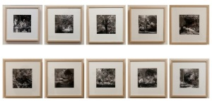

Aun podéis ver la exposición “Vergèlia” de Elisenda Ribes. No os la perdáis, está en la Casa Golferichs, en la Gran Vía de Barcelona con la calle Viladomat. Hasta el 31 de Diciembre a un paso de Plaza Cataluña podéis ver en la biblioteca de este centro entre libros y algunos alumnos que corren por la sala con sus primerizos trabajos esta fantástica obra de diez fotografías que compone “Vergèlia”:

“Fotografies dels espais que viuen més enllà de l’ordenació original dels creadors dels horts, jardins i parcs retratats en el seu esplendor, detinguts per a la mirada i la visita de qui trobarà la magnificència, entre humil i orgullosa alhora, amb la que tota aquesta vida rau mig amagada i perenne.”

“Fotografías de los espacios que viven más allá de la ordenación original de los creadores de huertos, jardines y parques retratados en su esplendor, detenidos por la mirada y la visita de quien encontrará la magnificiencia, entre humilde y orgullosa a la vez, con que toda esta vida acontece escondida y perenne.”

Aprovechar ahora que aun está en Barcelona… 😉

  
“Vergèlia”  
Centre Cívic Golferichs  
Espai Català i Roca  
Gran Vía 491  
  
[Mostra un mapa més gran](http://maps.google.es/maps?gl=es&vpsrc=0&ie=UTF8&t=w&ll=41.380632,2.156204&spn=0.015134,0.030663&z=16&source=embed)