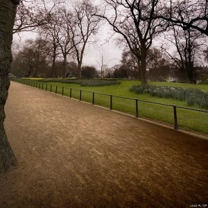
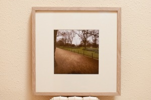

St. James’s Park” – [Lluís Ribes i Portillo (cc)](http://creativecommons.org/licenses/by-nc-nd/2.0/)

Esta fotografía fue tomada en el 2007 y es uno de los caminos del parque de [St. James’s Park](http://www.royalparks.org.uk/parks/st_james_park/history.cfm) en Londres. De visita, iba acompañado por este céntrico parque cuando me mostraron la vista que había con el London Eye al fondo entre los árboles del parque ya sin follaje. Hasta ese momento había ignorado tal sutil vista, sin duda Jules tuvo buen ojo. Aproveché la geometría que me ofrecía el camino e hice la foto y tras un reencuadre de formato cuadrado en el laboratorio digital el resultado ha sido esta foto : [St. James’s Park](http://www.flickr.com/photos/lluisr/485200542/in/photostream/) que se ha materializado en un cuadro tras 4 años.

Esta foto forma parte de una pequeña colección de fotos que podéis verla aquí: [Londres 07](http://www.flickr.com/photos/lluisr/sets/72157600056574677/show/) a raíz de una visita a Londres en 2007. Os recomiendo que la veáis, hay algunas fotografías que a día de hoy me parecen todavia muy interesantes, es un buen pequeño trabajo.

  
Descripción

-   “[St. James’s Park](http://www.flickr.com/photos/lluisr/485200542/in/photostream/)” (#110011/#000001)

[St. James’s Park](http://www.flickr.com/photos/lluisr/485200542/in/photostream/) se ha materializado en un cuadro con un delicado marco de madera claro. El paspertú, de un color blanco roto acompaña la fotografía (18,6cm x 18,6cm) que ha sido impresa personalmente usando un papel de alta calidad de 310g/m2 brillante. La tinta y la impresión garantizan más de 70 años sin ninguna pérdida de color.

