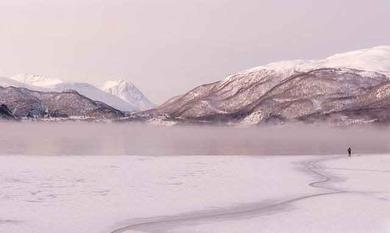
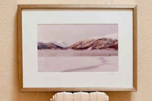

<figure id="attachment_2393" aria-describedby="caption-attachment-2393" style="width: 630px"><figcaption id="caption-attachment-2393">Balsfjorden – <a href="http://creativecommons.org/licenses/by-nc-nd/2.0/">Lluís Ribes i Portillo (cc)</a></figcaption></figure>

Balsfjorden es un precioso fiordo de Noruega que en invierno se llena de blanca nieve y se forman playas con la congelación del agua. Quienes seguís mis fotos esta os sonará porque está tomada en el mismo lugar y momento prácticamente que la foto “[Pescador Noruec](http://www.flickr.com/photos/lluisr/5421790215/)” [donde podéis encontrar más información en una entrada a mi blog](http://lluisr.blogspot.com/2011/02/pescador-noruec.html) unos meses atrás.  
Esta vez, la fotografía es una panorámica de tres fotos tomada con tranquilidad y nitidez con el objetivo de 85mm y un trípode que se undía en la nieve. Cada vez que veo esta foto viajo a aquel lugar tranquilo y de alguna forma remoto.

Descripción

-   [“Balsfjorden”](http://www.flickr.com/photos/lluisr/5421790215/) (#110012/#000001)

Todo el proceso desde la toma de la fotografía hasta el montaje pasando por la edición e impresión han sido realizados por mi personalmente mimando la calidad de todo el proceso.

La primera copia de la fotografia se ha materealizado en un cuadro con un marco plateado sobre una superficie rojiza dándole un tono rojizo cercano al rosado que la fotografía muy sutilmente adquiere. Un clásico paspertú blanco y como detalle y a petición expresa se ha escrito a mano en el pastertú la localización de la foto. La fotografía impresa (31,1cm x 18,6cm) en papel brillo de alta calidad de 310g/m2 se ha impreso con tintas que permiten la logetividad del color a más de 70 años.  
