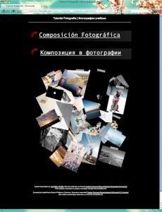

¡Hola!

hace unos cuantos meses atrás [publiqué un pequeño tutorial de composisión fotográfica](http://lluisr.blogspot.com/2011/04/tutorial-de-composicion-fotografica.html) con la intención de ofrecer una pequeña referencia y reflexionar sobre la composición en este arte.

Pues bien, ahora ya está disponible una nueva versión que incluye su traducción al ruso y una pequeña simpática página de error si introduces una dirección equivocada dentro del “site“.  
De verdad, si tenéis compañeros rusos y están interesados en sacarle un poco más de provecho a sus fotos pasarle el link, la traducción es excelente.  
La dirección web ha cambiado:

[http://compofoto.lluisribes.net](http://compofoto.lluisribes.net/)

pero no os preocupéis quienes tengáis la antigua dirección todavía está en funcionamiento pero actualizar vuestros enlaces.

¡y seguir siempre al elefante!  
