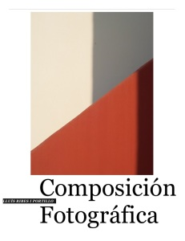

Ya está disponible el [tutorial sobre composición fotográfica](http://compofoto.lluisribes.net/) adaptado al formato iBook de iPad y iPad2. En esta versión puedes llevártelo encima en tu tableta con todas las funcionalidades del formato iBook entre las que destaco:

-   Disponible en la tienda de iTunes
-   Acceso directo al índice poniendo la tableta en vertical y con dos dedos cerrar la ventana
-   Posibilidad de consultar un término de forma rápida en el propio diccionario de la tableta o en la Wikipedia
-   Poder tomar apuntes, dejar notas, subrallar y señalar palabras y frases enteras que son recogidas en un cuaderno del libro
-   Enlaces directos a Internet
-   Se adapta a la lectura horizontal y vertical

en lo que a la obra en sí respecta del tutorial del web se suman las siguientes mejoras:

-   Revisión del texto de algunos capítulos haciéndolo más agradable a la lectura
-   Anexo con todas las fotos de ejemplo en alta calidad

Podéis bajaros el libro gratuitamente desde este link:

[http://goo.gl/tkoB4](http://goo.gl/tkoB4)