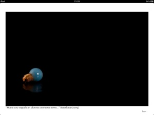
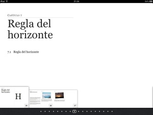
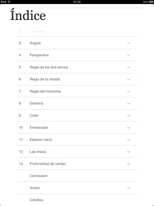
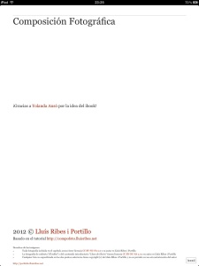
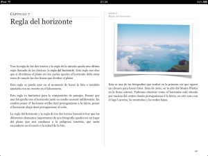
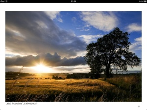

He tenido que improvisar una entradilla visual para el iBook de Composición Fotográfica ([http://goo.gl/tkoB4](http://goo.gl/tkoB4) ) , la verdad es que la foto que salía al inicio en la primerísima versión del libro era una experiencia un tanto frustrante si era la primera vez que lo abrías…:

Los cambios ya están en marcha. Y ya puestos os dejo algunas capturas de pantalla del iBook 🙂

