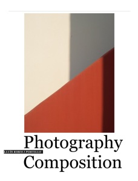

Ya está aquí la versión en inglés del tutorial de *“Composición Fotográfica”* para iPad preparado especialmente para verla en la versión más reciente de iBooks 2:

[“Photography Composition” – Lluís Ribes i Portillo](http://itunes.apple.com/es/book/photography-composition/id540903847?l=ca&mt=11) 

Disponible en las 32 tiendas del iTunes. Recordad que podéis ver el tutorial también en la web con cualquier navegador en [http://compofoto.lluisribes.net](http://compofoto.lluisribes.net/)