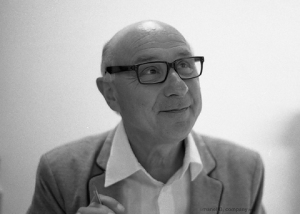
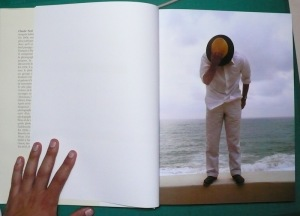

Claude Nori – foto [Manel O. Company](http://manelcom.blogspot.com.br/)

Hace dos semanas fui a la inauguración de la exposición del fotógrafo Claude Nori en la galeria [Valid Foto](http://en.validfoto.com/) de Barcelona. [Ignasi](http://followgram.me/iclapers) y [Montse](http://moontseta.blogspot.com.es/) siempre me alertan de estos eventos y la verdad es que este fue genial.

No conocía a este fotógrafo, ni sus fotografías de las que me enamoré. Fotografías mediterranias de los años 80 y 90, del amor de juventud, sus chicas todo ello con un aire melencólico, romántico e inocente. La exposición se centra en dos trabajos, **“Les desirs sont dejà des souvenirs“** y **“Stromboli”**

La primera foto del  libro “Jours Heureux Au Pays Basque”

A todo ello Claude fue simpático, en la presentación de la exposición estaba destendido y elegante y luego muy cercano. Le compré el libro de *“[Jours Heureux Au Pays Basque](http://www.amazon.fr/Jours-heureux-au-Pays-basque/dp/B005C85SAC)“* de su editorial Contrejour. Un libro de fotografía muy recomendable que mediante reflexiones, poesía, citas nos habla de diversos temas de la vida a través de su experiencia. Todo ello con fotografías tomadas desde que en 1999 se instaló en Biarritz, fotografías en blanco y negro y en color. De tapa dura con 240 páginas encontramos algunas fotografías que ocupan unas dimensiones de 34cm x 24cm que son todo un lujo.

Si queréis ver sus fotos, hasta el 10 de septiembre estará la exposición en [Valid Foto](http://es.validfoto.com/), pasaros que vale la pena. La galería Valid Foto está en Barcelona muy cerca del Arco de Triumfo.

Si queréis ver las fotos de la expo, en la web de Valid Foto las tendréis:

[es.validfoto.com/?pageID=251](http://es.validfoto.com/?pageID=251)

Y si queréis saber un poco más sobre Claude Nori

-   Su web: [www.claudenori.com](http://www.claudenori.com/)
-   Su blog: [www.claudenori.com/blogs/claude-nori](http://www.claudenori.com/blogs/claude-nori%20)
-   Un post de Paco Elvira sobre la expo: [www.pacoelvira.com/2012/06/exposicion-de-claude-nori-en-la-galeria.html](http://www.pacoelvira.com/2012/06/exposicion-de-claude-nori-en-la-galeria.html)

Por último agradecer a Claude la dedicatoria del libro porque la personalizó con mucho detalle tras una breve conversación que tuvimos. Merci Beaucoup!