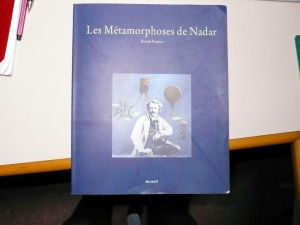
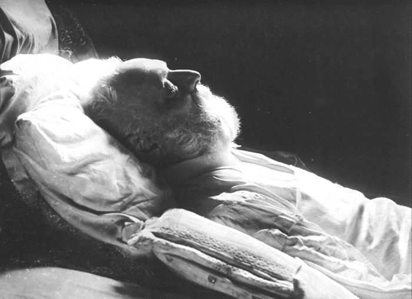

Gràcias [Jordi](https://twitter.com/canyissa) por descubrirme Nadar a través del libro “*Les Métamorphoses de Nadar*“:

Estos dos días he podido aprender un poco más y disfrutar de este artista: Nadar. ¿Quién era Nadar? no voy a escribir nada nuevo sobre él, os dejo que busquéis información más detallada en Wikipedia y en Internet pero en resumen fue un fotógrafo parisino (entre otros oficios) del siglo XIX y principios del XX.

Para mi lo más particular es que gracias a él tenemos una gran cantidad de retratos de personajes de esa Francia revolucionaria que vio nacer la *La Troisième Republique*. Un ejemplo, si buscáis información en la Wikipedia de [Eduard Monet,](http://es.wikipedia.org/wiki/%C3%89douard_Manet) [George Sand](http://es.wikipedia.org/wiki/George_Sand), [Eugène Delacroix](http://es.wikipedia.org/wiki/Eug%C3%A8ne_Delacroix) encontraréis un retrato de cada uno de ellos de Nadar. Pero tiene muchos más. Uno de los retratos que más me gusta y más conocido de Nadar es el de Víctor Hugo en su lecho de muerte:

Víctor Hugo – fotografía de Nadar