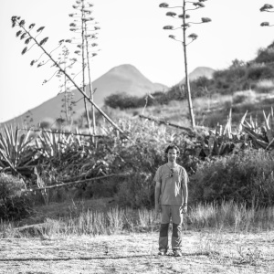

Estudiando los apuntes del taller subo esta foto que me realizó Monika un día que hicimos un ejercicio de retratos (sí, en el [taller de Cabo de Gata](http://www.talleresencabodegata.com/) hicimos una práctica!) .

¡Gracias Mónika!

*Lluís Ribes, el Palmeral 2012 – foto [Monika Horstmann](http://www.efecuatro.es/monika-horstmann) (c)*