Hola,

[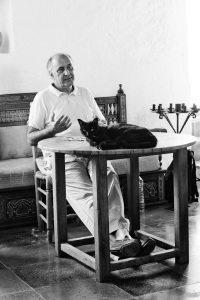](http://www.lluisribes.net/wp-content/uploads/2012/08/Eduardo-Momen-CC-83e-DSC_0440.jpg)

*Eduardo Momeñe, Cabo de Gata ’12* – [Lluís Ribes (cc)](http://creativecommons.org/licenses/by-nc-nd/3.0/)

este artículo es un resumen o recopilación de mis apuntes tomados durante los cinco días del workshop de [Eduardo Momeñe](http://www.eduardomomene.com/) “*La Visión Fotográfica*” en los [talleres de fotografía de Cabo de Gata 2012](http://www.talleresencabodegata.com/) de [Óscar Molina](http://www.oscarmolina.com/). Veréis que en este resumen procuro darle un cierto hilo conductor entre los apuntes pero a veces puede ser un tanto caótico o pecar de profundizar poco. Pero no es muy importante, lo importante sobretodo es que tenéis una recopilación de autores de varios campos como la fotografía, el cine, la pintura o la literetura para que podáis iniciar pequeñas *excursiones intelectuales*. 

El porqué de la inundación con tantas referencia es básicamente para darnos materia prima para construir en nuestras cabezas la visión particular del mundo de cada uno. Posteriormente, en este caso que nos ocupa que es con la fotografía, hablaremos de él.El resumen es largo, tomarlo con tiempo y volver tantas veces como necesitéis al artículo. Cuando haya algo que os interese profundizar por Internet, la biblioteca, preguntar. Pero sobretodo disfrutar, tenéis todo el tiempo que querráis para ello.  
 

Dedicado al grupo del taller, gracias por compartir amistad.

**Confrontación**

Fotografíar es hablar con la boca cerrada: esta es nuestra confrontación con la realidad, tenemos una cámara y le tenemos que sacar la realidad que ella guarda. ¡Y no se puede hacer con palabras! tan “solo” haciendo un click.

[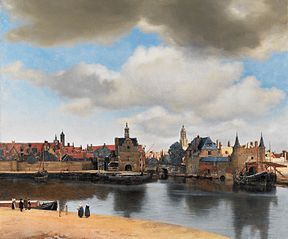](http://www.lluisribes.net/wp-content/uploads/2012/08/288px-Vermeer-view-of-delft.jpg)

La Vista de Delft

Esta confrontación pudo ya comenzar en el siglo XVII cuando la [cámara oscura](http://es.wikipedia.org/wiki/C%C3%A1mara_oscura) era usada por los pintores como herramienta para captar la realidad en un plano en dos dimensiones que les ayudaba a crear sus obras. *“[La Vista de Delft](http://es.wikipedia.org/wiki/Vista_de_Delft)”*, una de las pinturas de [Johannes Vermeer](http://es.wikipedia.org/wiki/Johannes_Vermeer) (considerado por algunos como el cuadro más bonito del mundo) parece que utilizó ya este artilugio con el puerto de Delft para posteriormente con una idealización del pintor plasmar en el lienzo ese paisaje.

[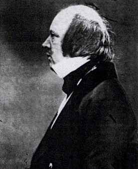](http://www.lluisribes.net/wp-content/uploads/2012/08/William_Fox_Talbot.jpg)

William Fox Talbot

Un siglo más tarde, [Fox Talbot](http://es.wikipedia.org/wiki/William_Fox_Talbot) un inventor inglés, inventó el [calotipo](http://es.wikipedia.org/wiki/Calotipo). Estamos hablando de 1830 y si os pica la curiosidad podéis ver la patente en el siguiente link [“Improvement in photographic pictures” Patente USA 1487](http://www.google.com/patents/US5171). Este artilugio permitía fijar una instantánea sobre un papel, en este caso un negativo del que se hacían posteriomente tantas copias como se quisieran. Podemos ver [una foto realizado por Fox Talbot con esta técnica](http://www.nationalmediamuseum.org.uk/Collection/Photography/RoyalPhotographicSociety/CollectionItem.aspx?id=2003-5001/2/23899) en los archivos en linia del [Museo Nacional del Media de Bradford](http://www.nationalmediamuseum.org.uk/). Este museo es muy recomendable visitarlo, situado a unos 200 km al norte de Londres se centra en la fotografía, cine, televisión y los nuevos medias.

[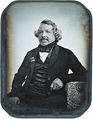](http://www.lluisribes.net/wp-content/uploads/2012/08/187px-Louis_Daguerre_2.jpg)

Louis Daguerre

Fox Talbot convivirá con [Louis Daguerre](http://es.wikipedia.org/wiki/Louis_Daguerre) quien desarrolló el [daguerrotipo](http://es.wikipedia.org/wiki/Daguerrotipo) que de igual manera que el calotipo anteriormente mencionado permite fijar una imagen, en este caso en una copia única, sobre una placa. De esta forma la fotografía está definitivamente inventada y permite capturar imágenes en pocos minutos o menos, imágenes como son los retratos y los paisajes. Ya no hace falta pintar para  tener un retrato, ya no hace falta pintar para inmortalizar un paisaje. Tenemos dos exponentes muy interesantes en el darregotipo que son [Southworth y Hawes](http://en.wikipedia.org/wiki/Southworth_%26_Hawes) dos americanos que lo usaron mucho para hacer una colección de retratos muy buenos en el siglo XIX. Podemos ver una recopilación de 80 suyas fotos en la siguiente galería virtual: [http://flic.kr/s/aHsiXxTpD9](http://flic.kr/s/aHsiXxTpD9)

Hablando de retratos damos un salto de época y nos vamos a Bill Jay, un crítico de fotografía con una buena cantidad de retratos. Su página web: [http://www.billjayonphotography.com](http://www.billjayonphotography.com/) podemos encontrar estos retratos así como todos sus artículos y críticas en pdf y una revista que publicó durante un año.

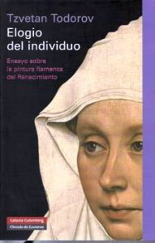

“Elogio del individuo”

Más sobre retratos podemos fijarnos en [Irving Penn](http://es.wikipedia.org/wiki/Irving_Penn) o en el libro de [Tzvetan Todorov](http://es.wikipedia.org/wiki/Tzvetan_Todorov) “Elogio del individuo” un excelente libro que es un ensayo sobre la pintura flamenca del Renacimiento altamente recomendable.

Y es que no siempre hay que ser innovador para obtener buenos resultados y las iluminaciones que se usaban en la pintura flamenca del Renacimiento nos regalaban excelentes instantáneas. Una de estas [iluminaciones es la Rembrandt](http://en.wikipedia.org/wiki/Rembrandt_lighting), tan sencilla como poner una luz a 45º con el plano de la cámara creando un juego de sombras y luces en el retrato que a día de hoy se usa con mucha efectividad.

[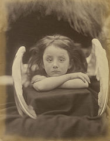](http://www.lluisribes.net/wp-content/uploads/2012/08/188px-I_Wait-2C_by_Julia_Margaret_Cameron.jpg)

*“I wait”* – Julia Margaret Cameron

Volvemos al siglo XIX. Hablamos de la fotógrafa [Julia Margaret Cameron](http://es.wikipedia.org/wiki/Julia_Margaret_Cameron) que hasta los 48 años no había tenido en la mano una cámara de fotos. A esta edad su hija le regala una cámara de fotos. A partir de ese momento nace una de las fotógrafas más reconocidas del siglo XIX plasmando una técnica muy personal en sus fotos. Julia Margaret Cameron ejerce amor a la fotografía como también lo hizo [Samuel Bourne](http://en.wikipedia.org/wiki/Samuel_Bourne) que con una cámara y planchas de cristal realizó miles de fotografías en el Himalaya con la técnica del colodión. Esto entre otras cosas implicaba arrastrar todo un laboratorio fotográfico del siglo XIX en carro por las vastas y primitivas rutas de las cordilleras del Himalaya a unos cuantos miles de metros de altitud. Este trabajo del Himalaya está plasmado en un libro llamado “Photographic Journeys in the Himalayas”. Posteriormente amplió su trabajo con una amplia cantidad de fotografías de la India.

Fijaros que llegados a este punto hemos utilizado mucho la palabra fotografía pero ¿sabemos o sabríamos dar con el significado de ella?.

Fotografía significa tan solo: escribir con luz

[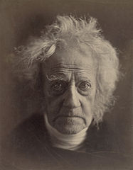](http://www.lluisribes.net/wp-content/uploads/2012/08/187px-John_Herschel_by_Jula_Margaret_Cameron-2C_Abril_1867.jpg)

John Herschel – Julia Margaret Cameron

[John Herschel](http://en.wikipedia.org/wiki/John_Herschel) inventó alrededor del año 1860 el término “*snapshot*” tan usado en nuestra fotografía de hoy así como sugerió a Fox Talbot el uso de sulfito de sodio para fijar las imágenes. John Herschel era matemático, astrónomo químico inventor y fotográfo experimental

Y hablando de derraguetipos y fotografía del siglo XIX saltamos al presente donde hay referentes fotográficos que usan técnicas primitivas como el codeleon. Un ejemplo es [Sally Mann](http://sallymann.com/)  y su alumna aventejada Judith Joy Ross ambas fotógrafas con un gran reconocimento hoy en día.

[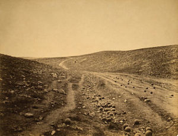](http://www.lluisribes.net/wp-content/uploads/2012/08/314px-RogerFentonvalley1-300x229.jpg)

“*El valle de la sombra de la muerte*” – Roger Fenton

Pero cuando la técnica del degarrotipo era aun la única que estaba disponible para realizar instantáneas aperecieron las primeras imágenes de nuevos campos fotográficos, como el reportero de guerra. Se puede considerar a [Roger Fenton](http://es.wikipedia.org/wiki/Roger_Fenton) como el primero de todos los tiempos. De igual forma que Samuel Bourne arrastra todo su equipo fotográfico compuesto por una caravana para cubrir la [Guerra de Crimea](http://es.wikipedia.org/wiki/Guerra_de_Crimea) a mitad del siglo XIX. De sus fotos, la más conocida es la del “El valle de la sombra de la muerte” realizada en 1855 en la guerra de Crimea. De ella hablamos un buen rato en el taller. Es una foto donde se realizó una emboscada pero no hay cadáveres ni señales de violencia, tan solo un camino en una valle con multitud de balas de cañón. De hecho existe otra foto suya sin las balas en el camino generando la discusión que nos ocupó un buen rato alrededor de la realidad de la fotografía, si puede ser documental o no, si es lícito que sea manipulada o no.

[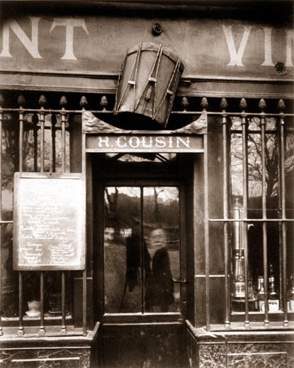](http://www.lluisribes.net/wp-content/uploads/2012/08/Au_tambour.jpg)

“*Au tambour*” – Eugène Atget

Alguien quien no manipuló los fotografías a pesar que no quiera decir que no nos llegara su visión subjetiva de su ciudad, era [Eugène Atget](http://es.wikipedia.org/wiki/Eug%C3%A8ne_Atget) . Atget, parisino entre el siglo XIX y el XX fracasó en muchos oficios hasta que se hizo fotógrafo donde pude subsitir. Fotógrafo con recursos limitados y hasta rudimentarios para le época, fuera de los círculos artísticos, consigue llevar a cabo un proyecto fotográfico alrededor de París durante su vida que se considera una de las obras más importantes de la fotografía. [Berenice Abbott](http://es.wikipedia.org/wiki/Berenice_Abbott), fotógrafa estadounidense le realizó tres días antes de su muerte un retrato y tras el fallecimiento de Atget en la más absoluta miseria Berenice compró parte de su obra. Es por ello que gran parte de la obra de Eugène Atget está en New York aunque en la biblioteca de París se puede consultar en su mayoría.

**Comienza el disparate**

[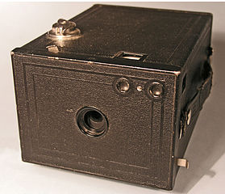](http://www.lluisribes.net/wp-content/uploads/2012/08/279px-Brownie2_overview.jpg)

Kodak Brownie No 2 – Håkan Svensson ([cc](http://creativecommons.org/licenses/by-sa/3.0/deed.en))

Nos aproximamos al siglo XX y [George Eastman](http://es.wikipedia.org/wiki/George_Eastman) inventaría la fotografía tal como la conocemos ahora a partir de su cámara [Kodak Brownie](http://en.wikipedia.org/wiki/Kodak_Brownie). Esta cámara permitía a su usuarío un acceso relativamente económico a la fotografía y centrarse solo en la toma de la imagen pues el revelado quedaba bajo la responsabilidad de Kodak. Este acceso a la fotografía permitió que cientos de miles de personas pudieran crear imágenes apareciendo el disparate visual: no se trata de hacer obras sino de registrar recuerdos. Como consecuencia de ello se toman  imágenes que no se contaban con ellas apareciendo un lenguaje sin reglas pero a la vez, esta ruptura de la imagen que produce libertad. Liberación.

Y aquí todo comienza a liarse mucho pero Eduardo Momeñe sostiene que desde entonces habrán dos opciones para fotografiar: 

1.  La opción “[Cartier-Bresson](http://es.wikipedia.org/wiki/Henri_Cartier-Bresson)” que es coger los juguetes fotográficos y domesticarlos y convertir la instantánea como algo de culto y una segunda opción 
2.  Donde situaríamos a [Jacob Riis](http://es.wikipedia.org/wiki/Jacob_Riis), [Lewis Hine](http://es.wikipedia.org/wiki/Lewis_Hine) o [Jaques Henri Lartirgue](http://es.wikipedia.org/wiki/Jacques_Henri_Lartigue) donde se realizan obras verosímiles no precisamente de arte. Es la intención de hacer fotos con sentido común. Otro ejemplo de este grupo sería [Walker Evans](http://en.wikipedia.org/wiki/Walker_Evans) que tan solo desea tener registros del mundo, liberarse de la responsabilidad de ser un artista. Este estadounidense curiosamente desembarcó en París en 1926 para ser escritor y volvió un año después decepcionado comenzando su carrera en la fotografía.

Dos opciones de fotografiar pero que no anula dos afirmaciones que se realizan en un momento dado de la clase:

La capacidad de tu mirada te da el mundo que ves

*El fotógrafo es un constructor de imágenes*

[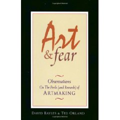](http://www.amazon.es/gp/product/images/0961454733/ref=dp_image_0?ie=UTF8&n=599367031&s=foreign-books)

Art and Fear – David Bayles Ted Orland

Para todos aquellos que quieren o tienen inquietudes a hacer arte se recomienda un libro, imprescindible, “[Art and Fear Observations On the Perils (and Rewards) of ArtMaking](http://www.amazon.es/Art-Fear-Observations-Rewards-Artmaking/dp/0961454733)” de David Bayles y Ted Orland. También otro libro que aparece de lectura obligatoria es “*[Una Filosofía de la Fotografía](http://www.casadellibro.com/libro-una-filosofia-de-la-fotografia/9788477389286/802649)*” de [Vilém Flusser](http://es.wikipedia.org/wiki/Vil%C3%A9m_Flusser)

En cuanto a la opción de hacer fotos con sentido común, menos artísticas, puede haber una relación del porqué tenemos tantos referentes de americana de la primera mitad del siglo XX. Ello ha podido ser por la cantidad de ciudades y sobretodo paisajes salvajes e inmensos de sus tierras de tal manera que no encontraron a faltar el uso de giros y metáforas y otros recursos más poéticos en sus fotografías para transmitir sensaciones potentes con sus imágenes.

[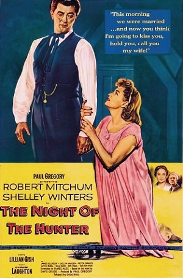](http://www.lluisribes.net/wp-content/uploads/2012/08/Nightofthehunterposter.jpg)

“*La noche del cazador*“

Esta visión más pragmática queda reflejada en otros artistas americanos de otros campos como [Woody Allen](http://es.wikipedia.org/wiki/Woody_Allen). Se recomendó la entrevista que realizó [Jean Luc Godard](http://es.wikipedia.org/wiki/Jean-Luc_Godard) a Woody Allen que [la podéis visualizar aquí](http://www.blogger.com/goog_1965144919)[, Meetin’ WA](http://www.openculture.com/2008/08/jean-luc_godard_meets_woody_allen.html).

Y hablando de cine, una película a ver “*La noche del cazador*” de [Charles Laughton](http://es.wikipedia.org/wiki/Charles_Laughton), una película recomendada.

Volvamos a la foto para reflexionar en las siguientes afirmaciones que aparecieron en el curso:

La primera es que *la fotografía debe hablar de lo concreto para hablar de lo general*.

La segunda más que una afirmación, es una  postura de Eduardo en frente de la fotografía ya que nos comenta que lo que le interesa es como se habla de algo no de lo que se habla. Es decir, le interesa el uso del lenguaje más que lo que quiere decir. En resumen, se busca la la emoción estética.

Otra afirmación, la soledad del corredor de fondo es mucha mucha muuuuucha… clara referencia a todos aquellos que quieren hacer obra, y de la que no se excluye la obra fotográfica.

[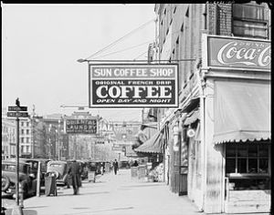](http://www.lluisribes.net/wp-content/uploads/2012/08/305px-SunCoffeeCanalSt1935-300x236.jpg)

*“New Orleansdowntown street, Louisiana*” – Walker Evans

Y como última afirmación de momento, una  que puede llevar a algún malentendido: Una (buena) fotografía, tras verla, debes salir más inteligente. Una puntualización personal es que aquí la inteligencia no se refiere tanto a una inteligencia intelectual o que el coeficiente intelectual te tiene que subir 0,1 puntos tras ver fotografía sino más bien a que la fotografía te debe provocar una experiencia en ti que te haga crecer si cabe un poco más en tu interior.

¿Y cómo se fabrica una buena una imagen que te haga más inteligente? esta pregunta puede encontrar una respuesta en Walker Evans: la mejor forma de hacer imágenes es dejarse de historias y disparar y disparar. Hacer fotos y más fotos es el camino a la respuesta de cómo hacer buenas fotos.

**Un lenguaje**

La fotografía es un lenguaje como tal, como es la música o la literatura. Esto tiene varias implicaciones. Una es que no se puede traducir la fotografía a música o a un escrito por ejemplo. Pensar en ello, no es trivial. Este lenguaje lo podemos, mejor dicho, debemos estudiarlo y entenderlo. La esencia de la fotografía está en ella misma. Cuanto más entendamos este lenguaje más nos permitirá disfrutar de la fotografía, nos ayudará a apreciar obras buenas y que no nos tomen gato por liebre. Posteriormente nos ayudará a poder crear nuestra obra.

Hay que diferenciar el proyecto linguístico del proyecto temático. El proyecto temático es hacer un trabajo de fotografía sobre un tema en concreto. El proyecto linguístico es en cambio el como uno fotografía, como construye la imagen independientemente de los temas que pueda tratar. Esto para Eduardo Momeñe es lo que más le interesa de un autor como deciamos unos parágrafos atrás. Conocer cómo cada uno de una forma más brillante o menos trabaja con el lenguaje fotográfico es lo más interesante ya que es una proyección del mundo interior del fotógrafo.A la carretera

[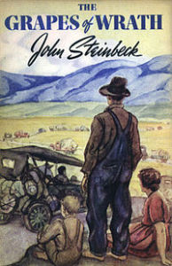](http://en.wikipedia.org/wiki/File:JohnSteinbeck_TheGrapesOfWrath.jpg)

The Grapes of Wrath

Para poder aprender este lenguaje es muy útil la idea de copiar. Todo el mundo lo hace, un ejemplo fotográfico puede ser [Robert Frank](http://es.wikipedia.org/wiki/Robert_Frank) que es una continuación de Walter Evans.

Hablando Robert Frank aparece el nombre de nombres en el curso muy interesantes: [Lee Friedlander](http://es.wikipedia.org/wiki/Lee_Friedlander) uno de mis fotógrafos favoritos y [Todd Papageorge](http://en.wikipedia.org/wiki/Tod_Papageorge). También aparece el título de una película que hizo Robert Frank: “[Pull My Daisy](http://en.wikipedia.org/wiki/Pull_My_Daisy)” que l[a podéis visualizar aquí](http://www.veoh.com/watch/v6406893MxQs3zEx?h1=Pull+My+Daisy) por si a alguién le puede interesar.

Enlazando con la idea de beber de fuentes cae un ejemplo de [Bruce Springsteen](http://en.wikipedia.org/wiki/Bruce_Springsteen) con [la canción de “*The Ghost of Tom Joad*“](http://www.youtube.com/watch?v=D_SxLsL3_tE) en donde Bruce se basa en la novela [The Grapes of Wrath](http://en.wikipedia.org/wiki/The_Grapes_of_Wrath)  de [John Steinbeck](http://es.wikipedia.org/wiki/John_Steinbeck). Como véis, todos tenemos fuentes de inspiración por eso hay que beber mucho

Para inspirarnos en la clase dejamos alguna recomendación de que mejor que que alguna Road Movies:

-   “*[Dead Man](http://es.wikipedia.org/wiki/Dead_Man)*” de [Jim Jarmusch](http://es.wikipedia.org/wiki/Jim_Jarmusch)
-   “*[Malas tierras](http://es.wikipedia.org/wiki/Badlands_%28pel%C3%ADcula%29)*” de [Terrence Malick](http://es.wikipedia.org/wiki/Terrence_Malick)
-   “*[Corazón salvaje](http://en.wikipedia.org/wiki/Wild_at_Heart_%28film%29)*” de [David Lynch](http://es.wikipedia.org/wiki/David_Lynch)
-   “*[Zabriskie Point](http://es.wikipedia.org/wiki/Zabriskie_Point_%28pel%C3%ADcula%29)*” de [Michelangelo Antonioni](http://es.wikipedia.org/wiki/Michelangelo_Antonioni)
-   “*[Thelma y Louise](http://es.wikipedia.org/wiki/Thelma_y_Louise)*” de [Ridley Scott](http://es.wikipedia.org/wiki/Ridley_Scott)

[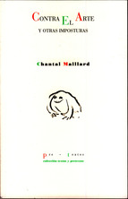](http://www.lluisribes.net/wp-content/uploads/2012/08/contra-el-arte-y-otras-imposturas-9788481919332.jpg)

“Contra el arte y otras imposturas”

cuyas películas muy seguramente se habrán basado en algunos casos en el escritor [Cormac McCarthy](http://es.wikipedia.org/wiki/Cormac_McCarthy)  autor de obras como “*[Meridiano de sangre](http://es.wikipedia.org/wiki/Meridiano_de_sangre)*”  o “*La carretera*”.

Otra película recomendada, “[*Alicia en las ciudades*](http://en.wikipedia.org/wiki/Alice_in_the_Cities)” de [Wim Wenders](http://es.wikipedia.org/wiki/Wim_Wenders)

Y volvemos a un libro, muy bueno que se llama “*Contra el arte y otras imposturas*” de [Chantal Maillard](http://es.wikipedia.org/wiki/Chantal_Maillard)  Esta recomendación apareció tras discutir sobre la emoción estética y la emoción primitiva, ambas distintas pero que pueden convivir en una obra. El libro puede desvelarnos alguna respuesta al respecto, o podemos optar por otro llamado “Wabi-Sabi, para artistas, diseñadores, poetas y filósofos” de [Leonard Koren](http://www.leonardkoren.com/) que nos ayudará sin duda en entender estas emociones comentadas.  
  

Pero ¿Y todo esto para qué?

Hasta ahora hemos visto qué es la fotografía, un poquito su historia, algunos autores, influencias pero ¿Para qué se hace fotos? La respuesta es sencilla aunque radical y atrevida a la vez: se hacen fotos para que alguien, que conoce el lenguaje fotográfico, diga WOW. Es decir hay que conocer el lenguaje, ya que sin el no habría un juicio maduro y se debe atacar a la emoción, a la emoción estética. 

Un ejemplo, leerse [Shakespeare](http://es.wikipedia.org/wiki/William_Shakespeare) sin saber inglés es inútil, sabiendo un poco de inglés puede ser interesante aunque puedes acabar no disfrutando del todo o dejando de entenderlo pero leerse Shakespeare siendo un entendido del inglés, habiendo leído mucha literatura inglesa y acabar con un WOW… bueno es lo que se llama obra en mayúsuclas.

Añado un apunte mío, no nos confundamos, las palabras también están en los catálogos de [supermercados Lidl](http://www.lidl.es/) y son muy útiles y usan el lenguaje pero no tiene nada que ver con la literatura. Con la fotografía lo mismo, no pongamos todo en el mismo saco.

Color

Comenzamos a hablar de Robert Frank como [John Cohen](http://www.johncohenworks.com/photo/overview.html) y [William Klein](http://en.wikipedia.org/wiki/William_Klein)  y nos metemos en un buen lío ya que comenzamos a hablar de una cantidad considerable de fotógrafos que vienen a continuación, todos ellos ya introducen el color en sus obras.

El introductor del uso del color de forma habitual en la fotografía es [William Eggleston](http://www.egglestontrust.com/) . Este, pese trabajar con color nunca dejará de ser un fotógrafo con una mirada en blanco y negro.

Recomendamos otro clásico de la fotografía en color, el libro “[American Prospects](http://www.amazon.com/Joel-Sternfeld-Prospects-Anne-Tucker/dp/1891024779)”  de [Joel](http://www.joelsternfeld.com/%20) [Sternfeld](http://www.joelsternfeld.com/%20) o la obra de [Joel Meyerowitz](http://www.joelmeyerowitz.com/%20) un fotógrafo extraordinario del blanco y negro que posteriomente pasó al color manteniendo la gran calidad de su obra.

[Stephen Shore](http://es.wikipedia.org/wiki/Stephen_Shore), otro prodigio de la fotografía en color a quien le marcó profundamente el libro “*The americans*” de Robert Frank. Uno de sus libros más recomendados es “*Lección de fotografía: la naturaleza de las fotografías*“

Más genios del color…, un fotógrafo que trabaja muy bien los paisajes en gran formato en color es [Richard Misrach](http://www.blogger.com/%20http://en.wikipedia.org/wiki/Richard_Misrach.%20) o [Mitch Epstein](http://www.mitchepstein.net/)  con un [excelente trabajo llamado “American Power”](http://www.youtube.com/watch?v=PeKiZUgzrr8) 

Y ya acercándonos al marco de la foto contemporánea actual destacar a [Bill Owens](http://www.billowens.com/)  que se convierte en un punto de inflexión con una fotografía directa que a día de hoy se ve en todas partes. Se recomienda su obra “[Suborbia](http://www.blogger.com/%20http://www.billowens.com/suburbia.html)”

Pero volvemos al mundo del cine y hablando de grandes directores de fotografía nos encontramos con [Sven Nykvist](http://es.wikipedia.org/wiki/Sven_Nykvist) uno de los grandes maestros. Su fotografía era directa, limpia y sencilla y del que se le acuña el término “[menos es mas](http://compofoto.lluisribes.net/es/Menos_es_mas.html)”.

Si las emociones las llevas dentro, las matemáticas dicen que saldrán

La verdad de lo no real

Hablando de cine quien no dice que es pura ficción independientemente del tema que esté tratando, pero cuántas cosas hemos aprendido con él. Y es que va a resultar que la mejor forma de hablar de la realidad es la ficción. No cabe duda. 

No se necesita la verdad, sino apariencias y con ellas  se puede llegar a pequeñas verdades

   
Si nos adentramos más en esta dualidad ficción y realidad llegamos al cine documental del cual hay dos referencias imprescindibles, dos clásicos a disfrutar visionándolos y reflexionar si la ficción es efectiva para mostrar la realidad:

“[Nanuk, el esquimal](http://es.wikipedia.org/wiki/Nanuk,_el_esquimal)”: [aquí podéis visualizarla](http://www.youtube.com/watch?v=_f8J9NRchOE) 

“[Hombres de Arán](http://ca.wikipedia.org/wiki/Man_of_Aran)”: [aquí podéis visualizarla](http://www.youtube.com/watch?v=ZXYC5Sv_fOQ)  
 

[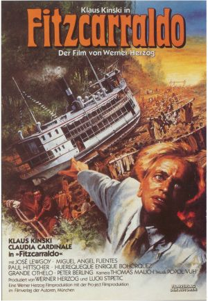](http://www.lluisribes.net/wp-content/uploads/2012/08/Fitzcarraldo.jpg)

Y continuando con este debate ficción realidad encontramos una película interesante al respecto. [Fitzcarraldo](http://es.wikipedia.org/wiki/Fitzcarraldo) del director alemán [Werner Herzog](http://es.wikipedia.org/wiki/Werner_Herzog). Es una película basada en el comerciante de caucho y explorador Brian Sweeney “Fitzcarraldo” Fitzgerald quien abrió una vía de fluvial para el comercio en la amazonia pero no sin ello con esfuerzos sobrehumanos llegando a sacar su barco (ojo, su barco no su barca) del agua y arrastrándolo a través de la selva con la ayuda de los indíginas de la zona para evitar unos rápidos que hubieron hecho a pedazos el barco. ¿Qué hizo Werner Herzog de cara a hacer una película lo más real posible? Pues todos los actores y extras realizaron tal gesta remolcando un barco de vapor por la selva tropical con sus propios medios mientras se rodaba, con las inevitables tensiones del equipo hasta el punto de producirse incidentes mortales. ¿Hace falta este realismo para enseñarnos la historia? Seguramente no. A todo ello se unió la locura del actor principal, [Klaus Kinski](http://es.wikipedia.org/wiki/Klaus_Kinski%20) cuyo interesante documental “[Mi querido enemigo](http://www.pagina12.com.ar/2001/suple/Radar/01-06/01-06-10/nota2.htm)”  reflejó las tensiones del autor con el director.

¿Y la fotografía? ¿Que pasa con ella? Pues que toda fotografía es ficción, ¿y qué pasa?

Aprender

Salimos del cine, de la confrontación realidad y ficción y entramos un poco en la corriente surrealista con un libro recomendado, “*[Lo Posible](http://artimanalibros.com/web/lo-posible-fotografias-de-paul-nouge/)*” de [Paul Nougé](http://en.wikipedia.org/wiki/Paul_Noug%C3%A9)  “Maupassant” y “el otro” de [Alberto Savinio](http://en.wikipedia.org/wiki/Alberto_Savinio) ambos libros de la corriente surrealista. Otro autor a revisar [George Stainer](http://es.wikipedia.org/wiki/George_Steiner) .

Esta introducción del surrealismo nos lleva a un fotógrafo llamado [John Pfahl](http://johnpfahl.com/%20) que usa espejos para realizar efectos especiales en sus paisajes con resultados muy interesantes.

[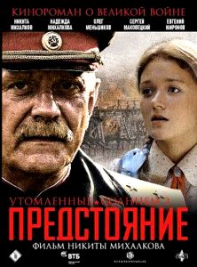](http://www.lluisribes.net/wp-content/uploads/2012/08/exodo_quemado_por_el_sol_2-227917431-large-222x300.jpg)

“Quemados por el sol”

Se habla de dos películas imprescindibles a ver de [Nikita Mijalkov](http://es.wikipedia.org/wiki/Nikita_Mijalkov)  “*Los ojos negros*” y “*Quemado por el sol*”. [Una entrevista a Mijalkov](http://www.youtube.com/watch?v=p70k56Zp3xU) os ayudará a conocer este gran director. Más recomendaciones por ejemplo con la película “[Shine](http://es.wikipedia.org/wiki/Shine_%28pel%C3%ADcula%29)” de [Scott Hicks](http://es.wikipedia.org/wiki/Scott_Hicks)  donde queda inmortalizado una pieza musical magistral de [Serguéi Rachmaninoff](http://es.wikipedia.org/wiki/Sergu%C3%A9i_Rajm%C3%A1ninov): [“La isla de los muertos”](http://es.wikipedia.org/wiki/La_isla_de_los_muertos_%28Rajm%C3%A1ninov%29)  [concierto](http://www.youtube.com/watch?v=dbbtmskCRUY%20) #3 para piano.

Y siguiendo con los rusos, ahora toca un fotógrafo, [Boris Mikhailov](http://en.wikipedia.org/wiki/Boris_Mikhailov_%28photographer%29)  un fotógrafo documentalista imprescindible para cualquier buen entendido de la materia.

[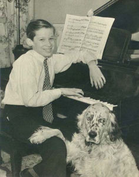](http://www.lluisribes.net/wp-content/uploads/2012/08/472px-YoungGould-236x300.jpg)

Gleen Gloud – G.W. Powley

Pero para aprender, para ser un poco más inteligente no dejamos la música de lado y no dejaremos de escuchar [piezas musicales de este extraordinario](http://www.youtube.com/watch?v=qB76jxBq_gQ) pianista, [Gleen Gould](http://www.glenngould.com/), o aprenderemos de la historia de [Paul Wittgenstein](http://es.wikipedia.org/wiki/Paul_Wittgenstein) pianista que perdió un brazo y desde una prisión siberiana le pidió a su profesor compositor Josef Labor que le enviará obras para que pudiera seguir tocando con un brazo. Más adelante, [Maurice Marvel](http://es.wikipedia.org/wiki/Maurice_Ravel)  le escribiría una obra famosa obra para él: [Concierto de Piano para la Mano Izquierda en Re Mayor](http://www.youtube.com/watch?v=DM2wy-e2igY)

Pero todas estas últimas referencias musicales no se introdrucen en vano ya que nos llevan a una más que recomendable novela de [Thomas Bernhard](http://es.wikipedia.org/wiki/Thomas_Bernhard)  titulada “*El malogrado*”. Trata de la desesperación de una persona en conseguir el talento de Gleen Gould y al no conseguirlo (porque en parte el talento se nace con él) muere en la más absoluta desesperación. Una novela que trata el tema del fracaso, las metas y exigencias que van más allá de las capacidades de cada uno que tan solo nos lleva a la más absoluta frustación. A leer, porque la fotografía puede ser para muchos de nosotros un camino de sufrimiento continuo si le damos la dimensión que no toca…

Llegados a este punto hay que recordar que vamos siempre aprendiendo. En los anteriores parágrafos hay mucha información de autores de toda índole que nos pueden aportar cosas con sus obras o sus experiencias construyendo así nuestro mundo particular. Y con nuestra fotografía intentaremos dar una visión de este mundo particular a través de una experiencia estética: la foto.

Pero continuamos con más referencias, a continuación la biblioteca que a Eduardo Momeñe le ha ayudado en parte a crear su visión del mundo:

-   “*La imagen y el movimiento*” de [Gilles Deleuze](http://es.wikipedia.org/wiki/Gilles_Deleuze): tesis sobre las pautas estilísticas filmográficas capaces de definir una época en el sentido a la vez histórico y filosófico de la palabra.
-   “*[Photography, Cinema, Memory](http://books.google.es/books?id=mhBic-4p3WUC&pg=PA33&hl=es&source=gbs_toc_r&cad=4#v=onepage&q&f=false)*” de Damian Sutton Damian Sutton : una exploración de la relación del tiempo entre la fotografía  y el cine 
-   “*Como si lo estuviera viendo*” de Salvador Rubio Marco: libro que aborda el tema de la imagen mnemónica o del recuerdo
-   “*Mirar al que mira*” de [Luis Puelles](http://es-es.facebook.com/lpuelles) : libro que hace un estudio sobre los espectadores
-   “*De la foto al fotograma*” de Rafael R. Tranche: Estudio de la relación y evolución de la fotografía y cine documental
-   “*The Ongoing moment*” de [Geoff Dyer](http://geoffdyer.com/) un estudio profundo y excelente sobre una serie de grandes fotógrafos
-   “*Giro visual*” de Fernando R. de la Flor: la escritura está dejando paso a un nuevo rey basado en las imágenes
-   “*Elogio del individuo*” Tzvetan Todorov: estudio de la pintura flamenca
-   “*Hiperión o el eremita en Grecia*” de Friedrich Hölderlin: novela con un carácter metapóetico donde explica la concepción de la creación artística como punto de unión entre el hombre y los dioses
-   “*Istambul*” de Orhan Pamuk: viaje a la Instámbul de Orhan Pamuk
-   “*Sociología visual*” [Jesús M. de Miguel](http://es.wikipedia.org/wiki/Jes%C3%BAs_M._de_Miguel_Rodr%C3%ADguez)  y Carmelo Pinto
-   “*Poesías reunidas*” de [Thomas Stearns Eliot](http://es.wikipedia.org/wiki/T._S._Eliot): poesías del premio nobel de Literatura en 1948
-   Los poemas de [Dylan Thomas](http://es.wikipedia.org/wiki/Dylan_Thomas), que se pueden escuchar algunos de ellos leídos por el mismo.
-   “*Bajo el bosque lácteo*” también de Dylan Thomas: invita a los oyentes a escuchar los sueños y pensamientos íntimos de los habitantes de una imaginaria localidad galesa, “Llareggub”
-   “*Oliver Twist*” y su adaptación filmográfica de [David Lean](http://es.wikipedia.org/wiki/David_Lean) 
-   “*Breve Encuentro*” de David Lean: drama romántico en el que se relata la corta aventura que viven un médico y una respetable mujer casada que se encuentran por casualidad en la estación del tren
-   [Jethro Tull](http://www.j-tull.com/)  el grupo de rock progresivo por excelencia
-   Ralph Gibson: la fotografía en estado puro de los que se destaca tres libros suyos, “*El sonambulista*”, “*Dejà Vu*” y “*Días en el mar*”

[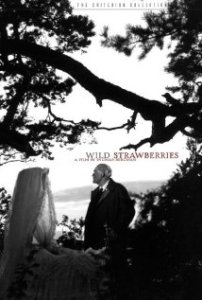](http://www.imdb.com/media/rm3940129024/tt0050986)

“*Fresas Salvajes*” – Ingmar Bergman

Vistas esas referencias Eduardo nos propone un ejercicio basado en una escena de la película de “*[Fresas salvaje](http://es.wikipedia.org/wiki/Smultronst%C3%A4llet)*” de [Ingmar Bergman](http://es.wikipedia.org/wiki/Ingmar_Bergman), una película recomendada a ver como no. La escena del sueño, un pedacito de obra maestra del cine, nos la tenemos que imaginar tras una descripción que nos hace el profesor con palabras. El ejercicio consiste en imaginarnos las fotografías para contarlo. La escena es la siguiente, [aquí está e imaginaros estar detrás de la cámara](http://www.youtube.com/watch?v=bSc9oBCWg8A&feature=related): 

Conceptualmente

¿Y las referencias de arte conceptual?. Respecto a estas influencias discutimos un rato sobre el arte conceptual y a la vez contemporáneo en muchas ocasiones. ¿Cómo nos afrontaremos ante estas posibles influencias? Pues bien, hay que recordar que para que no nos tomen gato por liebre antes hemos de aprender arte, ser más inteligentes al respecto, ¿os acordáis de esta idea de ser más inteligente ? Con ello podemos pasar a disfrutar del buen el arte conceptual y con unas referencias que sacamos entre unos cuantos del taller que pongo a continuación seguro que podemos disfrutar de ello. Estas son recomendaciones de artistas conceptuales:

-   [Richard Long](http://www.richardlong.org/)
-   [Hamish Fulton](http://www.hamish-fulton.com/)
-   [Marina Branovich](http://es.wikipedia.org/wiki/Marina_Abramovi%C4%87)
-   [Joseph Beuys](http://es.wikipedia.org/wiki/Joseph_Beuys)
-   [Ed Ruscha](http://es.wikipedia.org/wiki/Edward_Ruscha)
-   [Nam JunePaik](http://www.paikstudios.com/)
-   [Antoni Muntadas](http://es.wikipedia.org/wiki/Antoni_Muntadas)
-   [Isidoro Varcárcel Medina](http://es.wikipedia.org/wiki/Isidoro_Valc%C3%A1rcel_Medina)
-   [John de Andrea](http://es.wikipedia.org/wiki/John_de_Andrea)
-   [Duane Hanson](http://en.wikipedia.org/wiki/Duane_Hanson)

Shhhhh…  
Y tras el arte conceptual unas últimas recomendaciones para llegar a unas reflexiones. 

Una de estas será la de [Andréi Tarkovski](http://es.wikipedia.org/wiki/Andr%C3%A9i_Tarkovski), uno de los directores en mayúsculas del cine del que invitamos ver como mínimo tres películas de él  “*El espejo*” “*Sacrificio*” y “*Nostalgia*” siendo obras con una gran carga poética donde seguramente controla el silencio o el no silencio casi tan bien como lo hacía el director [Mark Berger](http://fm.berkeley.edu/people/faculty/149-2/)  que fue un auténtico maestro en ello. También lo fue [Béla Tarr](http://es.wikipedia.org/wiki/B%C3%A9la_Tarr) que no dejaba indiferente siendo considerado para algunos como el mejor director del mundo o el peor para otros. Destacar sus películas “*El hombre de Londres”* y “*El caballo de Turín*” dos piezas de cine increíbles.

Y es que la relación del silencio con la fotografía es total: toda la fotografía del siglo XX se basa en el ruido, lo difícil es hacer salir el silencio, ese puede ser uno de los nuevos objetivos y retos a conseguir, hacer que las fotos hablen del silencio.

Porque la cámara habla

Nosotros tan solo la programamos

Pero el silencio es lo que no vemos

Fin.