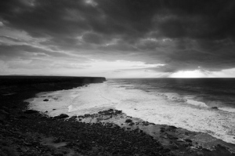

“En un lloc de la costa de Fuerteventura” – [Lluís Ribes i Portillo (cc)](http://creativecommons.org/licenses/by-nc-nd/3.0/)

> *“¡Estas soledades desnudas, esqueléticas de esta descarnada isla de Fuerteventura! ¡Este esqueleto de tierra, entrañas rocosas que surgieron del fondo del mar, ruinas de volcanes; esta roja osamente atormentada de sed! ¡Y qué hermosura! Claro está que para el que sabe buscar el íntimo secreto de la forma, la esencia del estilo, en la línea desnuda del esqueleto, para el que sabe descubrir en una calavera una hermosa cabeza.”*

[Miguel de Unamuno](http://es.wikipedia.org/wiki/Miguel_de_Unamuno)