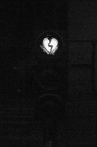

 “En vermell” –  [Lluís Ribes i Portillo (cc)](http://creativecommons.org/licenses/by-nc-nd/3.0/)

> *“La tristeza es el modo de adaptarse a la incapacidad de conseguir algo. Es, pues, un paso previo a la felicidad. No seriamos felices sin pasar por la tristeza.*“

[Michael Gazzaniga](http://en.wikipedia.org/wiki/Michael_Gazzaniga)