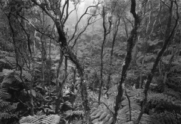
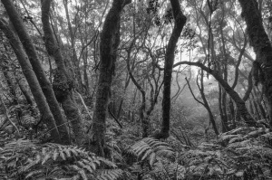

Hola,

ojeando el libro de [Ansel Adams](http://es.wikipedia.org/wiki/Ansel_Adams) [“*In the National Parks*”](http://www.goodreads.com/book/show/8997043-ansel-adams-in-the-national-parks) me topo con una foto que realizó en 1948 en el cráter de Kilauea en Hawaii. Inmediatamente me viene a la cabeza unas fotos que realicé en 2009 en los Montes de Ánaga, Tenerife:

Fern Forest, Kilauea, Hawaii National Park, Hawaii, c. 1948 – [Ansel Adams © Ansel Adams Publishing Rights Trust/CORBIS](http://www.corbisimages.com/stock-photo/rights-managed/AD001188/fern-forest-kilauea-hawaii-national-park-hawaii)

Monts d’Ànaga, Tenerife 2009 – [Lluís Ribes (cc)](http://creativecommons.org/licenses/by-nc-nd/3.0/)

Son dos puntos distanciados geográficamente por más de 13000 km. aproximadamente. Unos 61 años pasaron desde que Ansel Adams tomó su foto y la mía. Y qué curioso, como se recuerdan entre ellas a pesar de esa distancia espacio temporal tan grande. 

Pero la verdad es que no hay tanta casualidad. Ambas localizaciones son bosques situados en zonas subtropicales, en el mismo hemisferio, en islas volcánicas donde los vientos húmedos del océano se condensan en espesas nieblas cada día cuando están obligados a subir por la ladera del volcán. Tanta humedad junto a una temperatura primaveral es justo lo necesario para que aparezca esta vegetación tan característica de helechos generosos y árboles de copa alta con sus troncos cubiertos de musgos. Este bosque se le conoce como laurisilva aunque es muy posible que la foto de Hawaii 300 años atrás no se hubiera podido realizar porque parece que las fayas (los árboles que creo ver en la foto de Ansel Adams) fueron introducidos por los portugueses en el siglo XIX alterando gravemente algunos ecosistemas endémicos de la isla hawaiiana y haciendo aparecer la laurisilva.

A todo ello la decisión por mi parte de usar blanco y negro en mi foto, tampoco es casual porque años antes de viajar a Tenerife ya me había interesado por la fotografía de Ansel Adams y sus paisajes en blanco y negro siendo mi foto el resultado de un proceso de aprendizaje por copia. Me gustaron las fotos de Ansel Adams, me quedaron retenidas en la cabeza y posteriormente he procurado aplicar una técnica que se acerca a la suya.