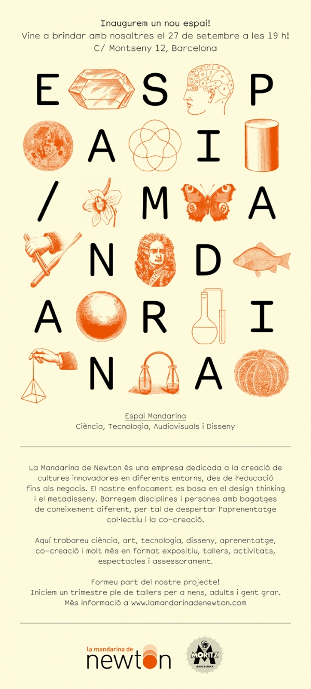

**[La](http://www.lamandarinadenewton.com/) [Mandarina de Newton](http://www.lamandarinadenewton.com/)** estrenó ayer local en el barrio de Gracia de Barcelona. Es un bonito local en la tranquila y céntrica calle de Montseny, a una cuadra de la estación de metro de Fontana (línea verde).

Este local ofrecerá talleres trimestrales, actividades puntuales, conferencias, debates, exposiciones todos ellos relacionados con los experimentos de la **ciencia, creación audiovisual, colaboración** y compartición de ideas.

Gracias a este local se podrán impartir los primeros talleres regulares de los que destacan por la gran cantidad los talleres para niños y niñas: *Exploradors!*, *Inventors!*, *Nens de cine!*, *Reciclem!*, *Electrizant!* o *Contes digitals*. Pero también hay talleres para los no tan chicos como el *Open Doc* y el *Grans fotògrafs digitals*. **Más información de cada uno de ellos** [aquí](http://sharingknowledge.es/cat/?p=529)

No dudéis a pasaros a chafardear el local y mirar las actividades que van a ir haciendo porque es un lujo de espacio tenerlo en Barcelona.

Y si creéis que podéis ofrecer montar un taller que esté en línea con *La Mandarina de Newton* (aprender ciencia, audiovisual, documentar todo ello con una pizca de diversión), desde mi modesta opinión, **no dudéis en proponer el taller porque puede interesar hacer el curso que tienes en mente.**