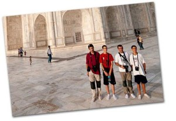
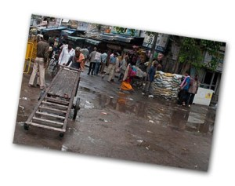

Inicio mi artículos del viaje de la India 2009.

El viaje a la India lo realicé con Ignasi y Jordi y un hijo de cada uno de ellos, Marc y Arnau respectivamente. Éramos tres generaciones y que nos une nuestra la afición por la fotografía y el viajar.  
Lo organizamos para realizarlo en dos semanas, las últimas semanas de Agosto, dado que nuestros calendarios profesionales no nos permiten aun hacer muchas virguerías :). La India es muy grande y 15 días son muy pocos pero decidimos tirar adelante.  
La ruta nos lo organizamos de la siguiente forma:  
Una primera semana donde estaríamos tres días en Delhi, y posteriormente iríamos en tren nocturno a Beranes (separadas por 800km) para estar tres días más, y la siguiente semana, volver a Delhi haciendo ruta por diferentes localidades de interés.  
Toda esta zona corresponde a la meseta del centro, básicamente el estado de Uttar Pradesh, aunque hicimos un poco de Rajhastan. En la meseta del centro podemos encontrar famosos lugares de interés turísticos que os paso a enumerar:

-   Agra, con el majestuoso Tah Majal
-   Delhi, la densa capital de la India
-   Beranés, la ciudad sagrada
-   Khajuraho, y sus templos eróticos
-   Orccha, con su fuerte y decenas de chattris
-   Gwalior, donde se situa uno de los fuertes más grandes de la India

Como podéis ver, los lugares corresponden a edificaciones y creaciones humanas, pues esta zona no tiene un especial interés los espacios naturales a excepción de algunas de las reservas naturales que se pueden visitar fuera de la época de lluvias (Octubre a Marzo).  
El alojamiento lo hicimos siempre en hoteles. Hay hoteles de todas las categorías, nosotros estuvimos en su mayoría en hoteles \*\*\*. Realmente bien, algunos muy bien pero no olvidemos que estamos en la India y la cierta dejadez de los indios se dejaba notar en algunos detalles. Pero ya iréis viendo los alojamientos.  
El transporte, hasta India desde Barcelona, con avión de Swiss haciendo escala en Zürich. Muy bien, aunque la opción de Aeroflot con escala en Moscú podría haber sido más exótica… Dentro del país el tren, transporte por excelencia con el que se llega a todas partes de forma segura y relativamente cómoda lo usamos para dos trayectos nocturnos largos. Pero en su mayoría recorrimos con coche, eso sí, con chófer: que a [ningún occidental turista loquero genuido creido confiado y fan de Michael Knight](http://www.youtube.com/watch?v=qb6dswG-nKw) se le ocurra alquilar y conducir un coche en la India, no es broma, es peligroso tanto para el cuerpo y la mente.  
La moneda, la rupia india cotizaba a unos 70 rupias por euro. En definitva, muy barato si tenemos en cuenta que se puede comer bien por 200 rupias. Eso sí, todo lo que se rodea de turismo, los precios pueden inflarse por 10, sobretodo en los artículos o souvenirs. Para que os hagáis una idea, el gasto total del viaje, con avión, hotel cada noche y una semana con un chófer y coche a nuestra disposición nos costó a cada uno de los cinco alrededor de los 1100 euros.  
El clima en verano, a pesar de ser monzón hace muchos días de sol, mucha calor y sí que a veces te cae un chaparrón. Pero lo más incómodo, la calor, puede ser muy penetrante e intensa a primera hora del mediodía.  
La comida, nada en especial, mucho arroz o tallarines si bien es cierto que en mi caso tomé a veces muchas preocupaciones para no caer enfermo y no varié la dieta más allá del chow-chop, el arroz con vegetales, el arroz al curry y la pizza Hut. Olvidaros de alcohol más allá de una poca cerveza, ah y en cuanto a picante creo que me da más miedo los restaurantes indús aquí en Barcelona.  
Medicinas y vacunas, antes conceder una entrevista con el centro médico de atención de viajeros de vuestra localidad. Por lo general, es fácil tener cuadros de diarrea (yo los tuve casi todos los días) por el cambio de alimentación o graves por una negligencia a la hora de comer ciertas cosas. Prevención con los mosquitos a pesar que no es una zona a día de hoy de alto riesgo de malaria, no está erradicada del todo la enfermedad allá. Creo que lo mejor es hacerse tu botiquín en tu casa y llevártelo, lo mismo que por poco que dudéis si mantendréis relaciones sexuales también llevaros de aquí todo lo que necesitéis. Y por último, un seguro de viaje que te cubra bien, y con disposición a tener traductor/intérprete.  
Llegados a este punto, no puede parecer la India (bueno, la meseta central que es donde estuvimos) un mal lugar para pasar unas vacaciones. Pero no os engañéis, ir a la India en plan turista a ver todas esas edificaciones tan estupendas puede convertirse en un viaje para olvidar. El calor, los vendedores más pesados que podéis encontraros sobre la faz de la tierra, la suciedad o la mierda, la incomodidad en algunos transportes, la comida, la constante timadura de pelo al turista (cuando este ejerce como tal), los animales que campan a sus anchas por las ciudades como unos ciudadanos más, hombre y animales defecando en la via pública, etc etc puede hacer mella en nuestra paciencia.  
Pero aquí está el secreto, la India es un lugar que hay que experimentar, tocar, ver y oler porque hasta que no estás allí no te crees nada de lo que [has podido ver en youtube](http://www.youtube.com/watch?v=RjrEQaG5jPM) o leer en blogs de viajeros. Lo increíble se hace creíble. A la vez en ningún lugar hay tanta aglomeración de diferentes religiones y culturas y formas de entender la vida conviviendo en espacios tan reducidos. Y esta cocktel te hace reflexionar.  
No encontré India muy agradable, pero sí altamente excitante. Y definitivamente hay que ir.  
Nosotros hicimos muy de turistas pero intentamos irnos de los circuitos turísticos algunas veces para entrar en contacto con la cálidez y simpatía de los indios, facultades que desaparecen cada vez más en los lugares de turismo. Y tras los escasos 15 días nos atrevimos a clasificar la India en tres:

-   La inmensa India pobre
-   La terrible India mísera
-   La pequeña India emergente

De estas tres Indias, estuvimos básicamente en la primera y en la última unas horas. Pero de ello y más hablaré en el próximo post.  
(NOTA: si no quieres esperar a que pase un año como me acostumbra a pasar hasta que cuelgo toda la información del viaje :), y estás desesperado para tener más información interesante de la India, visita [http://www.loliplanet.com/](http://www.loliplanet.com/) . Nos ayudó a disfrutar más de la experiencia en este país)