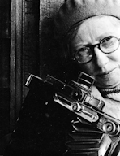

Hola,

dos exposiciones a visitar si estás por Barcelona o Madrid. Imprescindibles si te gusta la fotografía en blanco y negro.

La primera exposición, en Barcelona en la [Fundación Foto Colectania](http://www.colectania.es/) (cerca de Travessaera de Gràcia con Vía Augusta). Una exposición que estará hasta enero del 2013 de [***Leopoldo Pomés***](http://es.wikipedia.org/wiki/Leopoldo_Pom%C3%A9s_Campello). Leopoldo Pomés (1931) es una persona polifacética tanto como artista o como empresario. Su carrera fotográfica es sobresaliente y es un referente sin duda de la fotografía del siglo XX. En esta exposición vemos su trabajo sobre Barcelona 1957, un trabajo que le encargaron para realizar un libro que finalmente no vio a la luz. La Fundación ha recuperado estas fotografías en una interesante exposición.

Encontraremos en ella fotografía de calle de la Barcelona de finales de los años 50, blanco y negro que nos recordará a Xavier Miserach, Eugeni Forcano o Joan Colom. A mi siempre me ha fascinado esa fotografía de una de mis ciudades y la audioguía en muchas de las fotos con una explicación del mismo autor de la foto nos acercará la intención del fotógrafo a nuestra visión. Entre estas audioguías hay una de una foto de un niño con cara de pocos amigos llevando una cesta que esconde una historia sorprendente detrás de ella. Pero no os la cuento, mejor que la descubráis.

En la exposición podremos ver un audiovisual que es una biografía de Leopoldo (está disponible en youtube en tres partes: [http://youtu.be/lOxHDV1WPxo](http://youtu.be/lOxHDV1WPxo) ) en donde podremos adentrarnos no solo en su fotografía sino en otras facetas de su vida muy interesantes, consultar libros que recogen otros proyectos fotográficos y disfrutar del buen ambiente de la sala de la Fundación.

Destacaría algunas de las fotos que siempre me fascinan de aquella época donde el tren cruzaba a descubierto la ciudad por las calles que actualmente son avenidas céntricas y como he dicho anteriormente la audioguía con explicaciones del autor.

[Imogen Cunningham (c)](http://www.imogencunningham.com/)

La segunda exposición, en Madrid es la de [***Imogen Cunningham***](http://en.wikipedia.org/wiki/Imogen_Cunningham) (1883), una maestra de la fotografía que estuvo haciendo fotos hasta prácticamente su muerte a sus 93 años. [La exposición](http://www.exposicionesmapfrearte.com/cunningham/) la realiza la [Fundación Mapfre](http://www.mapfre.com/fundacion/es/home-fundacion-mapfre.shtml) (al lado de los Jardines Plaza Pablo Ruiz Picasso).

La exposición es una retrospectiva de su obra con 200 fotografías expuestas de forma exquisita. Se dividen en 5 bloques: “retratos”, “flores, paisajes y bodegones”, “el cuerpo y la danza” y “vida y arquitectura urbana”.

A mi [personalmente me encantó los paisajes](http://www.imogencunningham.com/page.php?page=archive&menu=landscape), como no podía ser de otra manera si fue una de las fundadoras de f/64 entre los que se incluye Paul Strand o Ansel Adams. El [bloque de las flores es una maravilla](http://www.imogencunningham.com/page.php?page=archive&menu=botanicals), puro blanco y negro y me sorprendió algunas fotografías, si no recuerdo mal del bloque de cuerpo y danza,  que eran [exposiciones dobles jugando intencionamente con dos fotografías que se fusionaban en una](http://www.imogencunningham.com/page.php?page=archive&index=0&menu=double). Pero tampoco dejaron de sorprenderme las fotografías de su familiares, la de su padre o la de sus hijos gemelos y [sus autoretratos](http://www.imogencunningham.com/page.php?page=archive&menu=self).

Vaya, una exposición muy buena de una autora excepcional. Podéis ver una extensa recopilación de su obra en la página web de la fundación que conserva su obra: [Imogen Cunningham](http://www.imogencunningham.com/)