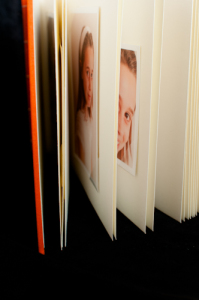
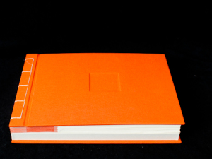
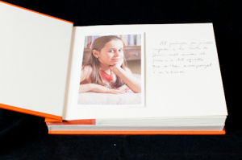
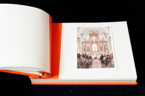
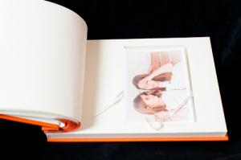
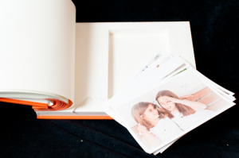
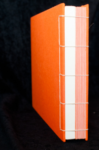
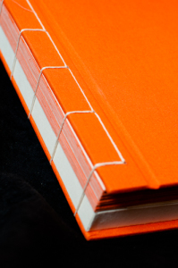

Hola,

os escribo un artículo de un pequeño proyecto de fotos que realizamos para la comunión de Mireia, que a su vez fue un regalo. El proyecto constaba en realizar las fotografías y hacer un álbum de su comunión. Nuestro objetivo era crear un objeto de recuerdo único para Mireia y la familia.

Las fotografías las realizamos en dos sesiones. Una primera una semana antes de la comunión en casa de Mireia con un pequeño equipo de flashes. Interiores, exteriores, con familia y sobretodo con el vestido tan tradicional de estas celebraciones en su pueblo. Escoger una semana antes de la comunión fue fantástico porque proporciono un tiempo y una tranquilidad idóneos para todos. El segundo grupo de fotos, se realizaron el mismo día de la comunión tomando fotos con una clara intención documental de la fiesta y el acto litúrgico. También adquirimos alguna copia del fotógrafo oficial de la iglesia dado que tenía fotos interesantes.

El álbum cerrado

Tras editar el conjunto de fotografías y escoger unas 45 se decidió seleccionar 15 fotos de esas 45 para montar la historia de su comunión. Tan solo 15 aunque se imprimió las 45 en un papel de alta calidad de 310g/m que a mi me gusta personalmente, el Carson Platine Fibre Rag. La impresión se realizó con una impresora que tenemos a nuestra disposición, que da una calidad muy alta, proporciona una impresión que garantiza un mínimo de 70 años de vida al color de la fotografía y bien, permite trabajar con papel de mucho gramaje sin problemas. Teníamos intención de hacer un álbum de pequeñas dimensiones en comparación a muchos de los que se hacen hoy en día que son grandes. El objetivo era hacer un pequeño álbum discreto, sencillo, bonito y poco aparatoso. Decidimos para ello un tamaño de las fotografías de 10cm x 14cm. Las fotografías quedaron muy bien impresas y no tiene nada que ver con una impresión en muchos de los laboratorios de fotografía que existen hoy aunque como veremos más adelante, un papel más fino hubiera ido mejor.

A la hora de montar el álbum tuvimos desde un momento claro el crear un álbum artesanal obteniendo un objeto único. Para ello contamos con la colaboración de Begoña ([Charnela Encuadernaciones](http://www.charnela-enquadernacio.com/), Barcelona) una gran artesana de la encuadernación en Barcelona. Decidimos hacer un álbum de quince hojas y que tuviera incorporado al final una cajita para poder guardar el resto de las 30 fotos. Recordar que teníamos 45 fotos, pero habíamos escogido 15 para la historia. Decidimos por una encuadernación con técnicas japonesas, usar para las hojas un papel de conservación Hahnemühle de un blanco roto y la portada y contraportada forrarla de tela naranja. Esta tela la usaríamos para forrar el lado de la página que une con el lomo creando así un elemento visual interesante de una franja naranja a la izquierda de cada hoja.

Una vez construido el álbum pasamos a colocar la fotografías con cantoneras. En este caso las cantoneras que adquirimos eran muy grandes y tuvimos que recortarlas y aun así unas cantoneras más pequeñas hubieran ido mejor. Las usadas finalmente tenían lados de 3 cm, en una foto de 10cm x 14cm como era el caso quizá hubiera ido mejor cantoneras de 1,5 cm.  Igual pasó con el papel de la fotografía, el gramaje de 310gr resultó un poco grueso para un formato tan pequeño y cuando cierras el álbum hay algunas hojas que por causa del papel de la foto ejercen presión y se abre un poco el álbum. A raíz de ello estamos actualmente probando papeles más finos para estos casos sin perder la calidad que queremos imprimirle a las fotos.

Detalle de la primera página

Detalle de una página con la franja naranja de tela

Detalle de la cajita para guardar más fotografías

Detalle de la cajita para guardar más fotografías

**Resumen**

El álbum creado tuvo muy buena acogida. La experiencia del álbum artesanal y de la calidad de las fotografías ha sido importante. También creemos que haber montado la historia con tan solo 15 fotografías ayuda a leer la historia sin agobios así como garantizar que son las mejores fotos, en todos los aspectos. Guardar las otras 30 fotos a parte en la cajita del álbum permite tras visualizar la 15, poder ver más instantáneas si apetece y disfrutar con más detalles de la comunión.

Detalle del Lomo

Detalle del hilo

A tener en cuenta, es un álbum delicado sobretodo porque la manipulación debe ser cuidadosa. El pase de cada hoja se debe hacer suavemente, sin prisa y con delicadeza. Guardarlo en un lugar sin mucha humedad es importante. Pero también cabe decir que este tipo de álbum es fácil de reparar por un artesano de la encuadernación si fuera necesario.

En definitiva un recuerdo muy especial para un día especial.

Si estás interesado en este artículo o tienes preguntas sobre él escríbeme a [hola@lluisribes.net](mailto:hola@lluisribes.net)