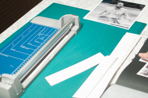
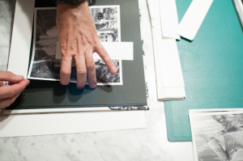
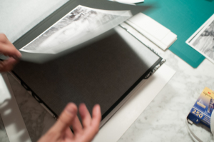
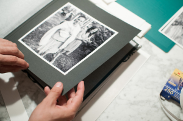

Hola**,**

Si te enfrentas a un reto de crear un álbum de fotos puedes tener en cuenta los diferentes puntos que expongo en este artículo a partir de una experiencia en un proyecto. Espero que puedan ser de utilidad o sino también puedes contactar conmigo en [hola@lluisribes.net](mailto:hola@lluisribes.net) para que te ayude.

  

**El proyecto** 

  

Ayer acabamos otro pequeño proyecto fotográfico. Este proyecto consistió en crear un álbum de fotos de una celebración de una boda. 

  

Nos hicieron llegar las fotos así como ya se había hecho una primera aproximación fallida en crear un álbum creado a través de la web [Blurb.com](http://www.blurb.com/) Este era nuestro punto de partida, fotos de una boda y un álbum que había que volver a hacer. Manos a la obra decidimos rescatar el proyecto con una proximación más serena.

  

Primero de todo, ¿Por qué el álbum de fotos creado a través de la web había fallado a pesar que la calidad del álbum era excelente? Varios puntos pero el principal  es que habían muchas fotos, con distintos formatos (formatos cuadrados, alargados, verticales, horizontales, panorámicos), fotos en blanco y negro y color y un error recurrente en este tipo de libros: las fotografías no se ven igual en el monitor que en el papel… el monitor es una fuente de luz y el papel no y si no se tiene en cuenta esto el resultado es un libro de fotos oscuras y tétricas.

  

**¿Qué hicimos?**

  

Plantear un álbum clásico. Entendemos un álbum clásico como aquel compuesto por un álbum vacío y le añadimos las fotografías impresas una por una, en este caso [mediante el uso de esquineras](http://www.dimaf.com/Item/9306_this.aspx). Esta decisión nos permite generar un álbum de fotos único y auténtico donde las fotos son eso, fotos dentro del álbum. No es ninguna cruzada en contra los álbumes que se encargan vía internet y donde la fotografía está impresa directamente en la página, como un libro o revista pero la experiencia de ver un álbum con fotos dentro sigue siendo un plus a tener en cuenta.

  

Más decisiones…

  

**Limitar el número de fotos**. Nos limitamos a hacer un álbum de 30 fotos, sí solo 30 fotos de las más de 100 fotos buenas que teníamos a nuestra disposición. Primer acierto, ser valientes y poner pocas fotos. Un álbum de fotos, igual que una novela, debe mantener la tensión y atención de quien lo ve desde la primera página a la última. ¿Cuántas veces hemos visto una álbum o un pase de diapositivas y antes de llegar a la mitad nos ha dado ganas de no ver más? Sin duda, un álbum con 100 fotos debe tener una fotografías excepcionales para llegar al final del libro sin aburrirse. Sí sí, excepcionales cosa difícil de encontrar.

  

**Crear una historia**. El orden de las fotos puede romper perfectamente el orden cronológico siempre y cuando se busque con ello reforzar la historia. Montamos la historia alrededor de la pareja y tuvimos mucho cuidado en crear un hilo entre cada foto: la llegada de invitados: amigos, familiares, gente joven, niños,… el banquete, el guateque y la traca final (los novios acabaron en la piscina).

  

**Limitar el formato**. Nos exigieron fotografía en blanco y negro (la fuente eran fotografías digitales en color). En contra de muchas opiniones esta fue una decisión difícil pero compatible en crear un buen álbum, pero se tenía que llevar al extremo. Ninguna fotografía de la boda en color. Puede ser una decisión muy personal, quizá controvertida pero el respeto de esta norma creó un álbum singular y simplifico la complejidad de combinar fotos en blanco y negro y en color. Tomada esta decisión se compró un álbum que pudiera ser compatible con esta decisión, básicamente un álbum con páginas negras. Y también limitamos el formato a 1:1, es decir todas las fotos eran cuadradas. Una decisión también que nos pidieron, tan buena como si se hubiera decidido por otro formato, ahora bien volvimos a exigir respetar esta decisión siempre. No porque no se pueda mezclar formatos, sino porque hay que ser muy bueno para combinar formatos diferentes y que no te aparezca una chapuza por una parte, y por otra, tener un mismo formato en las fotografías permite no distraer al lector del álbum y concentrarse en la historia que las fotos te están intentando hablar. ¡Facilitemos a los lectores del álbum su lectura!

  

**Generar fotos de calidad**. ¿Cómo? Pero ya teníamos las fotos y no se podían volver a hacer… pues bien las fotos pueden necesitar de un trabajo posterior de laboratorio. Este proyecto lo necesitó y trabajamos las sombras en las fotos para extraer más detalle dándole más luz y a la vez que no desapareciera los contrastes. Sin este trabajo, las fotos hubieran vuelto a quedar oscuras fuera de la pantalla e inservibles. 

  

**Un buen proceso de impresión**. Para ello contamos con un equipo profesional de impresión que nos permite para trabajos de poco volumen una calidad muy superior a la de prácticamente todos los negocios de revelado de fotos. Se quería un papel con brillo, y ofrecimos papeles artísticos de museo que van más allá del papel de las tiendas de revelado y tras diversas opciones se decantó por un papel satinado de 310gr. Cada foto tenía un tamaño de 20cm x 20cm medida que se escogió tras tener el álbum en las manos y comprobar que la foto a este tamaño encajaba perfectamente con la de la página del álbum de 23cm x 23cm. El resultado fueron unas fotos únicas y excepcionales en el papel.

  

**Por último el montaje**. Aquí nos implicamos todos incluído la persona que iba a realizar este regalo y quien hizo las fotos. Cortamos las fotos con una cortadora dejándolas con un leve borde blanco, para resaltar la foto sobre la página negra. Pusimos las esquineras página por página y tras hora y media de trabajo acabamos el álbum de fotos. El resultado nos gustó mucho pero a los novios todavía más, no se lo esperaban y ! fue un éxito!

  

**¿Las claves?**

  

Escuchar las ideas iniciales, intentar respetarlas en la medida que fuera posible para llevar a buen puerto el proyecto. Estas ideas iniciales, como pueden ser el formato cuadrado, el blanco y negro le ha dado personalidad al álbum y junto a otras decisiones han facilitado que las fotografías no dejaran de contar una/la historia.   
  
Tuvimos la suerte de partir de un conjunto de buenas fotografías que tan solo debían ser escuchadas y pulidas como si de pequeñas piedras preciosas se trataran, y han sido las fotografías sin duda las protagonistas de este proyecto éxitoso.  
  
La fotografía es un lenguaje, un lenguaje que no se puede describir en su totalidad con texto y las decisiones tomadas en este proyecto de acotar el número de fotos, de estudiar bien su orden, de respetar un formato homogéneo y de materializarlas sobre un soporte físico de calidad creemos que ha permitido que las fotos hablen de ese día tan especial que fue para los novios.

  

 a disfrutar,

  

Detalle de la cortadora

Poniendo las esquineras

Detalle del álbum

Detalle de una foto en el álbum