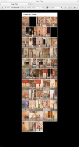

Hace prácticamente un año realicé unas fotografías de las pilonas del *Carrer de Comte* de Tarragona. A la vez escribí un pequeño artículo que explicaba qué eran estas pilonas tan curiosas y un poco su historia. Si aun no sabéis de qué hablo podéis leer el artículo aquí:

[El Carrer de Comte](http://www.lluisribes.net/?p=183)

Pues bien he vuelto este fin de semana a Tarragona con motivo del [festival de fotografía Scan](http://www.scan.cat/) y pasé un momento por la calle con la cámara y me dispuse a volver a enregistrar todas las pilonas.

-   Las nuevas fotos, del año 2012, están aquí: [http://fotos.lluisribes.net/carrer\_de\_comte\_2012/](http://fotos.lluisribes.net/carrer_de_comte_2012/)
-   Las antiguas fotos, del año 2011, están aquí:[http://fotos.lluisribes.net/carrer\_de\_comte](http://fotos.lluisribes.net/carrer_de_comte)**/**
-   (**nuevo**) Web con las fotos del 2011 en el lado izquierdo y las fotos del 2012 en la derecha: [http://fotos.lluisribes.net/carrer\_de\_comte.html](http://fotos.lluisribes.net/carrer_de_comte.html)

**Observaciones**

Una vez hechas las fotos y comparándolas con las del año pasado prácticamente todas (menos 4) han sido repintadas con nuevos dibujos, creo que las vuelven a pintar para la fiesta mayor de la calle. Dos pilonas han desaparecido, aunque uno de ellas creo que la han movido al final de la calle. Creo que hay una pilona nueva ya que no adivino porque no la encuentro entre las del 2011 (quizá me la salté y no le hice foto…). Otro detalle, también han bautizado la calle como el *Pilon’s Street* (aunque oficialmente mantiene el nombre *Carrer de Comte*) y no entiendo el porqué en inglés. En cualquier caso, yo hubiera puesto *Pilow’s Street* o directamente El *Carrer dels Pilons*. Pero es una opinión de alguién que vive lejos de ahí, eh 😉

Como habéis visto en el segundo link del artículo, he vuelto a montar la misma web de las fotos,  conservando el mismo orden como las había subido el año pasado. En esta nueva web, hay unos huecos negros, esos son las pilonas que no existen y las dos nuevas que son las dos últimas fotos, tras la foto del “new” nombre de la calle.

Me ha sido imposible conservar la misma tonalidad y color entre las fotos de este año y las del año pasado, en parte porque las fotografías de este año han sido fruto un poco de la casualidad y no tenía toda la información a mano para reproducir los parámetros de la cámara, la luz era un poco diferente y por otra parte aunque hubiera tenido lo que no he tenido tampoco creo que lo hubiera conseguido :-). Pero no por ello podemos disfrutar en buscar las pilonas que no han sido repintadas, las pilonas que han sido repintadas parcialmente, las paredes que han cambiado, los graffitis que se conservan así como comprobar que hay un local que sigue estando en alquiler o como la cocina no estaba abierta o observar que ya no tienen cubos de basura en la calle. Bueno, si encontráis más cosas comentarlas ! 🙂

[http://fotos.lluisribes.net/carrer\_de\_comte.html](http://fotos.lluisribes.net/carrer_de_comte.html)