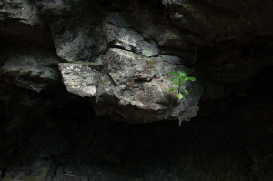

 (sense nom) –  [Lluís Ribes i Portillo (cc)](http://creativecommons.org/licenses/by-nc-nd/3.0/)

“La cámara es un instrumento que enseña cómo mirar sin la cámara”

[Dorothea Lange](http://es.wikipedia.org/wiki/Dorothea_Lange)