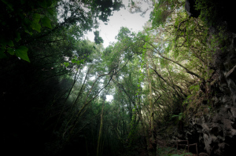

Poza en La Palma –   [Lluís Ribes i Portillo (cc)](http://creativecommons.org/licenses/by-nc-nd/3.0/)

> *“Qué tontería por mi parte creer que sería de esa manera. Me había confundido la apariencia de árboles y automóviles, y las personas con la realidad misma, y creí que una fotografía de estas apariencias es una fotografía de la misma. Es una triste verdad que nunca seré capaz de fotografiarla y sólo puedo fallar. Soy un reflejo fotografiando otro reflejo dentro de un reflejo. Fotografiar la realidad es fotografiar nada.”*

[Duane Michals](http://es.wikipedia.org/wiki/Duane_Michals)