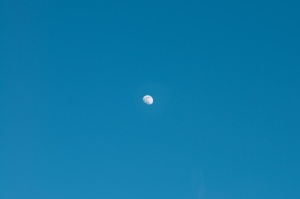

*“Lluna canària”* –   [Lluís Ribes i Portillo (cc)](http://creativecommons.org/licenses/by-nc-nd/3.0/)

> “La vida es una construcción mental de una serie de ilusiones. Estamos tan ocupados discurriendo sobre la superficie de las cosas, que nunca las miramos realmente. Es necesario trabajar tenazmente para permanecer con vida y aferrarse a la humanidad.

> ¡Permanece todo lo vulnerable que puedas! Se hace más difícil cada vez, pero en tu vulnerabilidad, en tus lágrimas y ansiedades, es donde está la poesía y tu propia verdad que sólo tú conoces. Y como artista sólo debes darme tus propios sentimientos. Y si no sabes cuáles son, si vas a fotografiar los sentimientos de otros, sus vidas, sus rostros, tu trabajo no será tuyo.

> Lo fundamental es que hables de tu propia verdad, como mujer, como hombre, como homosexual, como hetererosexual, o como lo que quieras ser. Se trata de ser consciente del tiempo y del momento, no sólo en el “momento puntual decisivo” sino en el gran momento de existir.

> Nunca habrá dos como tú en el Universo. Tú eres más importante que Cristo, que Adams, que Greta Garbo,… Tú eres el acontecimiento que nunca se duplicará. Cuando eres consciente de ello, todo se vuelve especial y preciado. Y si no encuentras curiosa esta vida, es que eres de tal forma producto de esta cultura, que ni siquiera sabes que respiras.”

[Duane Michals](http://es.wikipedia.org/wiki/Duane_Michals)