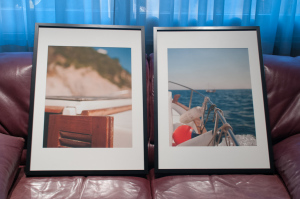

sense títol – [Lluís Ribes i Portillo (cc)](http://creativecommons.org/licenses/by-nc-nd/3.0/)

Estas dos fotografías las he impreso para unos marcos Ikea de 50 cm x 70 cm. de mi hermano. Las colocará en una amplia habitación de paso usada como sala de trabajo en un gran pared en frente de las ventanas.

Las fotos las realicé en el 2011 en una *Menorquina* de unos amigos justo cuando dejábamos el puerto de Llafranc de Palafrugell y cruzábamos el Faro de San Sebastián de dicha localidad rumbo norte. Era finales de septiembre, cerrando la temporada de verano, un domingo con una luz sensacional. Con mi cámara en mano encontré estas dos instantáneas: La puerta de la cabina, cuidadosamente barnizada que habla de la nobleza de este tipo de embarcación. Al fondo, la montaña sobre la que se levanta el faro y nos sitúa en el mapa. La segunda foto, la blanca proa que rompe el inmenso mar azul creando una ola de la que se ve su cresta y al fondo, otro marinero de viaje, porque en todo viaje siempre encuentras compañía.

Ambas las tengo en el flickr, de hecho las originales son un pelo diferentes porque he adaptado el encuadre al marco de Ikea. Podéis ver las dos fotos originales aquí:

-   [http://www.flickr.com/photos/lluisr/6186972480/in/photostream/](http://www.flickr.com/photos/lluisr/6186972480/in/photostream/)
-   [http://www.flickr.com/photos/lluisr/6182756549/in/photostream/](http://www.flickr.com/photos/lluisr/6182756549/in/photostream/)

Es curioso, ese día prácticamente no hice fotos, y las más interesantes son estas dos que creo que ya no pueden existir una sin la otra ni la otra sin la una.