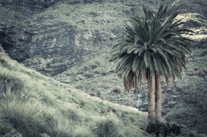

“La palmera de dos troncs” – [Lluís Ribes i Portillo (cc)](http://creativecommons.org/licenses/by-nc-nd/3.0/)

La palmera de dos troncos es única en su especie. Se encuentra al finalizar el Camino de los Romeros, a tocar de San Pedro.