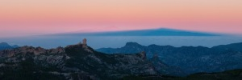

*[L’ombra](http://www.flickr.com/photos/lluisr/8354301051/in/photostream/) – [Lluís Ribes i Portillo (cc)](http://creativecommons.org/licenses/by-nc-nd/2.0/)*

El Pico de las Nieves es el punto más alto de la isla de Gran Canaria. Situado a 1949 metros sobre el mar es un excelente mirador de la isla así como de otras del archipiélago. Además es de fácil acceso, una carretera sube hasta el finalizando tras un cuartelillo militar donde se llega al parquing del mirador del mismo pico.

La foto que adjunto en el artículo está tomada desde este punto geográfico en un amanecer. Encarado a noroeste el sol sale a mi espalda. A primera estancia las cordilleras de Gran Canaria con sus monumentos naturales tan característicos de los roques. Más allá de la isla el océano cubierto en un ligero mar de nubes y al fondo la isla de Tenerife (¡no confundir con la sombra!) con su característico pico del Teide (iluminado en un rosa matinal). La isla de Tenerife no se ve entera, al sur, a la derecha en la foto las nubes tapan la depresión entre la meseta principal y la mesete de Ánaga que resurge un poco ya fuera de esta fotografía. Finalmente, al norte, izquierda de la foto, a los pies de Tenerife vemos la sombra de la isla de La Gomera.

Pero lo que más mes gusta de esta fotografía y con lo que más disfruté a la hora de hacerla es ver el fenómeno de la sombra triangular o piramidal. Este fenómeno creo que se da en aquellas islas con una cierta altitud donde al amanecer cuando el sol todavía está a muy baja altura y los rayos son poco perpendiculares acaba dibujando la pirámide sobre el mar o la ligera niebla. Aquí podemos ver la sombra en un color azulado que va más allá de la isla de Tenerife.

La forma de la isla ayuda a que el efecto pirámide se magnifique pero no necesariamente debe tener la isla esa forma geométrica. En realidad esta sombra también se puede contemplar en las montañas desde los picos más altos de la zona pero en una isla es algo un tanto más mágico.

Desde la vecina isla de Tenerife se puede obtener magníficas fotos de este efecto desde su pico más alto, el Teide a 3800 metros. Para saber de que hablo tan solo hay que buscar en un buscador de imágenes “Sombra Teide Piramide”.

Si queréis ver la fotografía original (9.000 px x 3.000 px) podéis ir al siguiente link: [http://www.flickr.com/photos/lluisr/8354301051/sizes/l/in/photostream/](http://www.flickr.com/photos/lluisr/8354301051/sizes/l/in/photostream/)