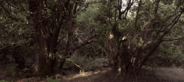

[Fayal-Brazal](http://www.flickr.com/photos/lluisr/8360807082/in/photostream) – [Lluís Ribes (cc)](http://creativecommons.org/licenses/by-nc-nd/2.0/)

Un ejemplo de bosque Fayal-Brazal en El Hierro. Este se sitúa justo por encima del Pinar en una orientación al sur.