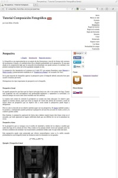
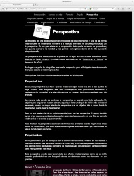

Hola,

hemos sacado una nueva versión del ***Tutorial de Composición Fotográfica***. Esta nueva versión ha recibido cambios en la presentación y las características de la web que pasaremos a anunciar.

A día de hoy está en versión ***beta*** en el manual en castellano y se puede ya visitar:

[http://compofoto.lluisribes.net/es/](http://compofoto.lluisribes.net/es/)

**A nivel de diseño:**

-   Se ha rehecho todo el diseño. Ahora pasa a ser de un color blanco muy limpio y aunque este punto no lo hemos cerrado sí que marca la tendencia: el blanco y un estilo minimalista
-   Las imágenes de ejemplo que pertenecen a mi colección de fotos están con una resolución mayor y se han incluído las leyendas con su nombre, lugar y año de toma.
-   Aparece una barra de navegación que permite ir a la anterior y a la siguiente regla de composición fotográfica.
-   En todas las páginas habrá un link a las versiones [iBook para iPad del tutorial](https://itunes.apple.com/es/book/composicion-fotografica/id502379182?l=ca&mt=11) y a las futuras versiones en pdf.

**A nivel de social:** 

-   Se añaden 4 botones para compartir cualquiera de las reglas en [Google+](https://plus.google.com/), [Facebook](http://www.facebook.com/), [Twitter](http://www.twitter.com/) y [LinkedIN](http://www.linkedin.com/).
-   Ahora ya es posible comentar cualquiera de las reglas dejando comentarios en la caja [Disqus](http://disqus.com/) al final de cada regla.

**A nivel tecnológico:**

-   Se usan meta-descripciones en cada página
-   Se usan URL amigables. Por ejemplo [compofoto.lluisribes.net/es/perspectiva.html](http://compofoto.lluisribes.net/es/perspectiva.html) pasa a ser [compofoto.lluisribes.net/es/perspectiva](http://compofoto.lluisribes.net/es/perspectiva)
-   Se simplifica la estructura interna mejorando la respuesta de la página aunque como contrapartida las nuevas opciones sociales añaden un plus de complejidad que en sistemas muy antiguos puede no ser compatible.

Podéis comparar la versión antigua con la nueva:

*Web nueva: [http://compofoto.lluisribes.net/es/Introduccion.html](http://compofoto.lluisribes.net/es/Introduccion.html)*

*Web antigua: [http://compofoto.lluisribes.net/es\_old/Introduccion.html](http://compofoto.lluisribes.net/es_old/Introduccion.html)*

Comentaros que en el transcurso de este mes aparecerá el tutorial en dos nuevos idiomas: croata, que ya está prácticamente listo e italiano. También vamos a rehacer la página principal y estamos mirando incluír publicidad.  
Por último, si conoces a alguien que quiera traducir el manual a su lengua materna y tiene experiencia en traducciones que se ponga en contacto con [lluis@lluisribes.net](mailto:lluis@lluisribes.net)  
¿Qué os parece?